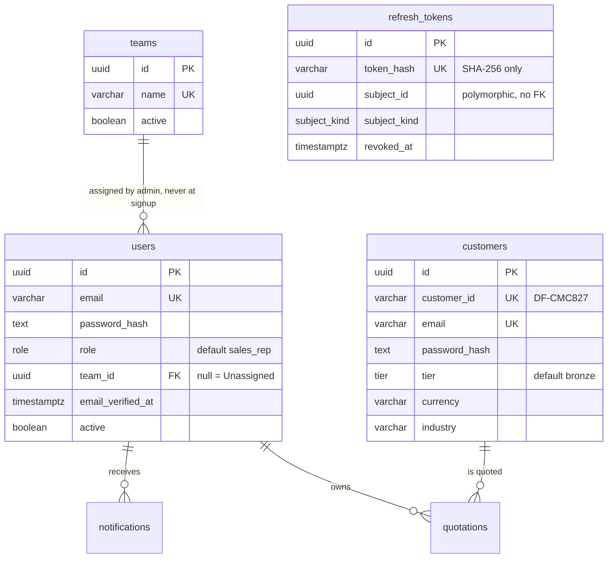
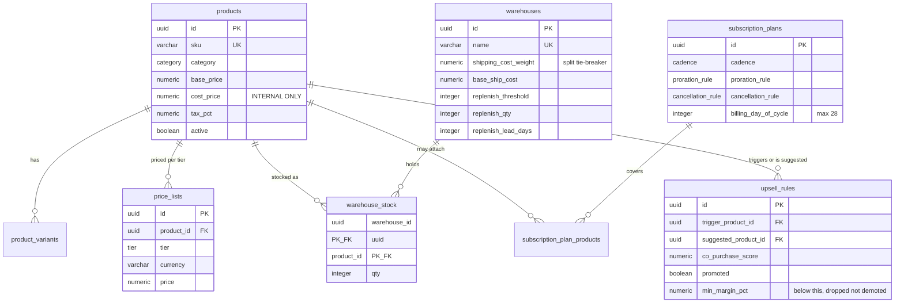
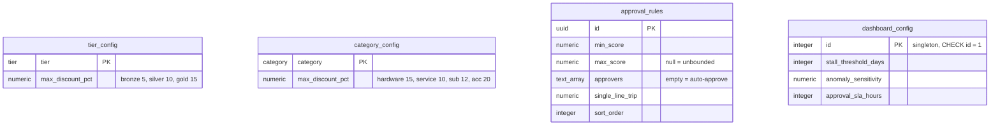
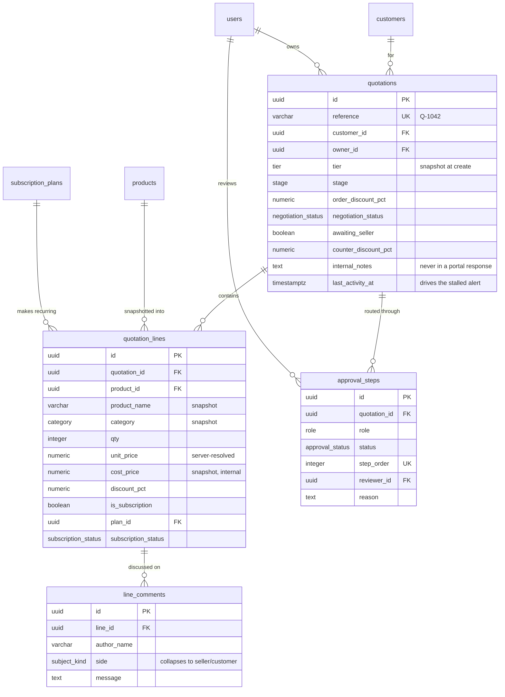
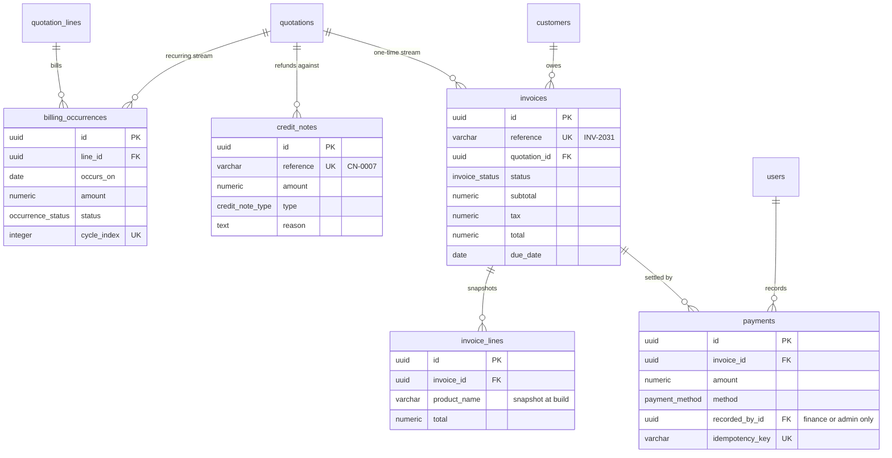
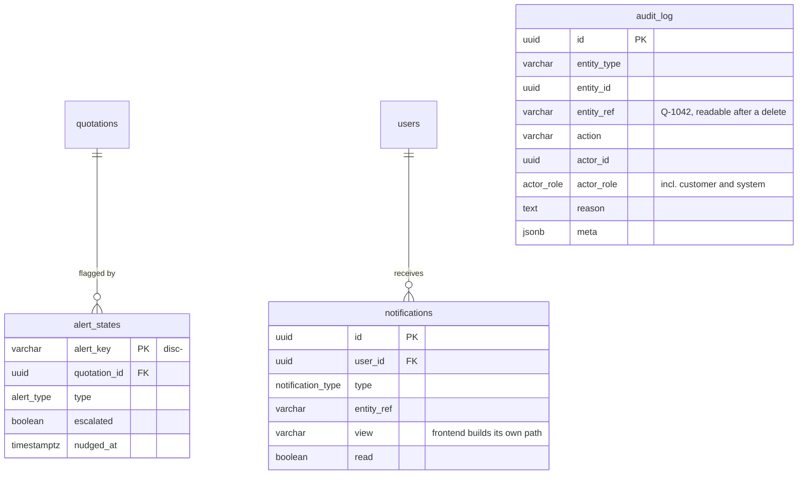

# DealFlow360 — Complete API Reference

**Team_413 · Odoo Hackathon 2026**

Every endpoint in the platform, in one file. Base URL `/api/v1`; all paths below are
relative to it.

| | |
|---|---|
| **Endpoints** | 113 across 17 modules |
| **Data model** | [§24](#24-data-model) — 31 tables, ER diagrams and the full DBML |
| **Postman** | [`../postman/`](../postman) — importable collection covering every endpoint |
| **Browser tester** | `npm run dev`, then <http://localhost:5050> |
| **End-to-end test** | `npm run e2e` — 92 assertions over the brief's 8-step flow |

---

## Table of contents

| § | Area | Endpoints |
|---|---|---|
| [0](#0-conventions) | Conventions | — |
| [1](#1-health) | Health | 2 |
| [2](#2-authentication) | Authentication | 10 |
| [3](#3-users-roles-and-teams) | Users, roles and teams | 5 |
| [4](#4-customers) | Customers | 5 |
| [5](#5-governance-configuration) | Governance configuration | 10 |
| [6](#6-catalog-and-pricing) | Catalog and pricing | 8 |
| [7](#7-warehouses) | Warehouses | 6 |
| [8](#8-subscription-plans) | Subscription plans | 4 |
| [9](#9-upsell-rules) | Upsell rules | 5 |
| [10](#10-risk-scoring) | Risk scoring | 3 |
| [11](#11-quotations) | Quotations | 15 |
| [12](#12-approvals) | Approvals | 5 |
| [13](#13-fulfillment) | Fulfillment | 5 |
| [14](#14-billing-and-subscriptions) | Billing and subscriptions | 8 |
| [15](#15-invoices-and-payments) | Invoices and payments | 5 |
| [16](#16-customer-portal) | Customer portal | 7 |
| [17](#17-dashboard-reports-audit-notifications) | Dashboard, reports, audit, notifications | 10 |
| [18](#18-enumerations) | Enumerations | — |
| [19](#19-error-catalogue) | Error catalogue | — |
| [20](#20-transactional-emails) | Transactional emails | — |
| [21](#21-quick-test-flow--api-calls) | Quick Test Flow → API calls | — |
| [22](#22-role-permission-matrix) | Role permission matrix | — |
| [23](#23-endpoint-index) | **Numbered endpoint index** | 113 |
| [24](#24-data-model) | Data model — ER diagrams + DBML | 31 tables |


---

## 0. Conventions

### 0.1 Success envelope

Every 2xx response is wrapped. Lists that paginate carry `meta` alongside `data`.

```json
{ "success": true, "data": { "...": "the resource" } }
```

```json
{
  "success": true,
  "data": [ { "...": "..." } ],
  "meta": { "page": 1, "limit": 25, "total": 137, "totalPages": 6 }
}
```

The wrapper is deliberate. A bare array leaves nowhere to put pagination without
changing the response type between the paginated and unpaginated forms of the same
endpoint, and a client that has to branch on `Array.isArray(response)` before it can
read an error is a client that will eventually get it wrong.

### 0.2 Error envelope

Consistent on every non-2xx. `message` is written in plain language because clients
render it directly.

```json
{
  "success": false,
  "error": {
    "code": "OVERPAYMENT",
    "message": "That is more than the outstanding balance of INR 224130.00.",
    "details": { "balanceRemaining": 224130, "attempted": 225130 }
  }
}
```

`details` is present only when there is something structured worth returning —
per-field validation failures, or per-cell allocation errors.

| Status | When |
|---|---|
| `400` | Malformed request, or a field the server assigns |
| `401` | Missing, invalid or expired token |
| `403` | Authenticated but not permitted — wrong role, or wrong identity space |
| `404` | Not found. **Also used instead of 403 when a customer requests another customer's record**, so the API does not confirm that the record exists |
| `409` | Business-rule conflict — approving a step that is not pending, editing a locked quotation |
| `410` | Expired one-time code |
| `422` | Semantically invalid — allocating more stock than exists, paying more than the balance |
| `429` | Rate limited |
| `500` | Server error. No internal message or stack is returned in production |

### 0.3 Strict bodies

Every request schema is `.strict()`. An unknown key is **rejected**, not stripped:

```json
{ "success": false,
  "error": { "code": "FIELD_NOT_ALLOWED",
             "message": "Request contains fields that are assigned by the server" } }
```

This is what makes `POST /auth/signup` safe. A client sending `"role": "admin"` gets a
400 rather than having the field quietly ignored — the difference matters, because
silent stripping means a mistake in the client looks like it worked.

### 0.4 Types

| Concept | Format | Example |
|---|---|---|
| Timestamp | ISO 8601, UTC | `"2026-03-14T09:32:00.000Z"` |
| Date only | `yyyy-MM-dd` | `"2026-03-28"` |
| Money | Number, major units, 2 decimals | `87400`, `1470.97` |
| Percentage | Number, not a fraction | `12.5` means 12.5% |
| Risk points | Number, 2 decimals | `5.33` |
| Currency | ISO 4217 | `"INR"` |
| Id | uuid v4 | `"3f2a9c14-…"` |
| Reference | Short, human-readable, unique | `"Q-1042"`, `"INV-2031"`, `"DF-CMC827"` |

**Ids and references are different things.** The uuid is what foreign keys point at.
The reference exists because people read it aloud — a rep says "Q-1042" on a call.
Keeping them separate means a reference can be reformatted later without touching a
single relationship.

### 0.5 Authentication

```
Authorization: Bearer <access token>
```

Access tokens last 15 minutes and cannot be revoked, so `requireAuth` re-reads the
account's `active` column on every request — that closes the window in which a
disabled account keeps working. Refresh tokens last 7 days, are stored as a SHA-256
hash, and rotate on every use; replaying a used one revokes **every** session for that
subject.

### 0.6 Two identity spaces

Staff and customers are separate populations with separate lifecycles.

- A **customer** token on any internal router → `403 WRONG_KIND`
- A **staff** token on `/customer/*` → `403 WRONG_KIND`

Checked server-side on every request. The `type` field on login selects which table
the credentials are checked against; it is not a privilege, because the password still
gates entry.

### 0.7 Rate limiting

A global limiter (default 100 requests / 60s per IP) **fails open** — a Redis outage
must not take the API down. The credential endpoints have a tighter bucket keyed on IP
*and* email, and that one **fails closed**: if the limiter cannot be consulted, login
is refused rather than left unprotected.

---

## 1. Health

| Method | Path | Auth |
|---|---|---|
| `GET` | `/health` | none |
| `GET` | `/health/ready` | none |

### `GET /health`

```json
{ "success": true, "status": "ok", "uptime": 1893.4 }
```

### `GET /health/ready`

Checks the database and Redis are actually reachable. Returns `503` when either is
down, so a load balancer can pull the instance rather than routing into a broken one.

```json
{ "success": true, "status": "ready", "checks": { "database": "ok", "redis": "ok" } }
```

---

## 2. Authentication

| # | Method | Path | Auth |
|---|---|---|---|
| 2.1 | `POST` | `/auth/signup` | none |
| 2.2 | `POST` | `/auth/verify-otp` | none |
| 2.3 | `POST` | `/auth/resend-otp` | none |
| 2.4 | `POST` | `/auth/login` | none |
| 2.5 | `POST` | `/auth/refresh` | none |
| 2.6 | `POST` | `/auth/logout` | any |
| 2.7 | `GET` | `/auth/me` | any |
| 2.8 | `POST` | `/auth/forgot-password` | none |
| 2.9 | `POST` | `/auth/reset-password` | none |
| 2.10 | `POST` | `/auth/change-password` | any |

`type` is `"internal"` (staff) or `"customer"` on every endpoint that takes it.

### 2.1 `POST /auth/signup`

```jsonc
// request
{
  "name": "Priya Sharma",              // 1–120 chars
  "email": "priya@teamvector.space",   // normalised NFKC, lower-cased
  "password": "S3cure!pass",           // min 8
  "type": "internal"                   // "internal" | "customer"
}
```

```json
{ "success": true, "message": "OTP sent successfully", "devOtp": "147470" }
```

`devOtp` appears **only** when `NODE_ENV` is not production *and* `EXPOSE_DEV_OTP=true`.
Double-gated on purpose: one flag alone is too easy to leave on.

**A `role` in the body is rejected with 400 `FIELD_NOT_ALLOWED`.** Signup always writes
`sales_rep`. Combined with role changes being admin-only, that is what makes `admin`
unreachable from outside — the first one is planted with `npm run seed:admin`.

For `type: "customer"` the account is created at **bronze**. Tier decides pricing, so
it is never self-selected.

| Error | Status | When |
|---|---|---|
| `EMAIL_ALREADY_REGISTERED` | 409 | The address exists in either table |
| `FIELD_NOT_ALLOWED` | 400 | A server-assigned field was sent |
| `OTP_RESEND_TOO_SOON` | 429 | Within the resend cooldown |

### 2.2 `POST /auth/verify-otp`

```jsonc
{ "email": "priya@teamvector.space", "otp": "147470", "type": "internal" }
```

```jsonc
// 200 — staff
{
  "success": true,
  "data": {
    "user": { "id": "uuid", "name": "Priya Sharma", "email": "…", "role": "sales_rep" },
    "accessToken": "eyJhbGciOi…",
    "refreshToken": "GuZAFAusNej2…",
    "expiresIn": 900
  }
}
```

```jsonc
// 200 — customer
{
  "success": true,
  "data": {
    "customer": {
      "id": "uuid", "customerId": "DF-CMC827", "name": "Acme Corp",
      "contactName": null, "email": "…", "tier": "bronze", "currency": "INR"
    },
    "accessToken": "…", "refreshToken": "…", "expiresIn": 900
  }
}
```

Codes are 6 digits, valid 10 minutes, 5 attempts, single use. Only an HMAC of the code
is stored in Redis — a cache dump does not hand out working codes.

| Error | Status |
|---|---|
| `OTP_INVALID` | 400 |
| `OTP_EXPIRED` | 410 |
| `OTP_TOO_MANY_ATTEMPTS` | 429 |

### 2.3 `POST /auth/resend-otp`

```jsonc
{ "email": "…", "type": "internal", "purpose": "signup" }  // purpose: signup | password_reset
```

Rate-limited by a cooldown (default 60s) → `429 OTP_RESEND_TOO_SOON`.

### 2.4 `POST /auth/login`

```jsonc
{ "email": "…", "password": "…", "type": "internal" }
```

Response is identical to §2.2.

**One message for every credential failure** — unknown email, wrong password, or an
address that exists only in the other table all return:

```json
{ "success": false,
  "error": { "code": "INVALID_CREDENTIALS", "message": "Invalid email or password" } }
```

Distinct wording would let anyone probe which addresses are registered. The server also
burns equivalent CPU hashing a dummy password on an unknown email, so response timing
does not leak the answer either.

| Error | Status | When |
|---|---|---|
| `INVALID_CREDENTIALS` | 401 | Any credential failure |
| `EMAIL_NOT_VERIFIED` | 403 | Signed up but never verified |
| `ACCOUNT_DISABLED` | 403 | `active = false` |

### 2.5 `POST /auth/refresh`

```jsonc
{ "refreshToken": "GuZAFAusNej2…" }
```

Returns a fresh pair. The old token is revoked immediately.

**Replay detection:** presenting an already-revoked token revokes *every* session for
that subject and returns `401 INVALID_REFRESH_TOKEN`. A replayed refresh token means
either a bug or a stolen one, and the safe response to both is to end all sessions.

### 2.6 `POST /auth/logout`

```jsonc
{ "refreshToken": "…" }   // optional; omit to end only the current session
```

`204 No Content`.

### 2.7 `GET /auth/me`

Returns the `user` or `customer` object from §2.2, re-read from the database rather
than decoded from the token — a rename or a role change is reflected immediately.

### 2.8 `POST /auth/forgot-password`

```jsonc
{ "email": "…", "type": "internal" }
```

**Always 200**, whether or not the address exists. Anything else is an enumeration
oracle.

### 2.9 `POST /auth/reset-password`

```jsonc
{ "email": "…", "otp": "147470", "password": "N3wS3cure!pass", "type": "internal" }
```

The new password is compared against the current one **before** the code is spent, so
a user who accidentally reuses their old password gets `409 PASSWORD_REUSED` and can
try again with the same code. Spending the OTP first would force them back through the
whole email round-trip for a typo.

On success every refresh token for that subject is revoked.

### 2.10 `POST /auth/change-password`

```jsonc
{ "currentPassword": "…", "newPassword": "…" }
```

Requires the current password even though the caller is authenticated — a 15-minute
access token on an unattended laptop should not be enough to take the account over.
Revokes every other session on success.

---

## 3. Users, roles and teams

| # | Method | Path | Who |
|---|---|---|---|
| 3.1 | `GET` | `/users` | any staff |
| 3.2 | `GET` | `/users/:id` | any staff |
| 3.3 | `PATCH` | `/users/:id` | admin, sales_manager |
| 3.4 | `GET` | `/roles` | any staff |
| 3.5 | `GET` | `/teams` | any staff |

**There is no `POST /users` and no `DELETE`.** Every staff account comes from
`POST /auth/signup`, so every account has proved its own email and chosen its own
password. An admin-created account would need an invite flow to do either, and the
brief does not list user provisioning among the admin's responsibilities.

### 3.1 `GET /users`

Query: `?role=&active=&teamId=&q=&page=&limit=`

```json
{
  "success": true,
  "data": [
    {
      "id": "uuid",
      "name": "Priya Sharma",
      "email": "priya@teamvector.space",
      "role": "sales_rep",
      "teamId": "uuid",
      "team": "Enterprise West",
      "active": true,
      "verified": true,
      "ownedQuotationCount": 7,
      "createdAt": "2026-02-01T10:00:00.000Z"
    }
  ],
  "meta": { "page": 1, "limit": 25, "total": 12, "totalPages": 1 }
}
```

`team` is `null` for an unassigned rep. No password material appears in any user
response, ever.

### 3.3 `PATCH /users/:id`

```jsonc
{
  "role": "sales_manager",   // admin only
  "name": "Priya Sharma",    // admin or sales_manager
  "active": false,           // admin only
  "teamId": "uuid | null"    // admin or sales_manager; null = Unassigned
}
```

The split is deliberate. Placing a rep in a territory is a manager's job and grants
nothing; granting a role or disabling an account changes what somebody can do, and
stays with the admin.

Three guards:

1. **An admin cannot change their own role** — self-demotion is how you end up with
   zero admins and nobody able to fix it.
2. **An admin cannot deactivate themselves** — that locks them out of the account that
   could undo it.
3. **The last active admin cannot be demoted or disabled** → `409 LAST_ADMIN`.

`role` cannot be set to `admin` through this endpoint: the schema enum excludes it, so
the request is rejected at the edge with 400.

### 3.4 `GET /roles`

```json
{
  "success": true,
  "data": [
    { "key": "sales_rep", "label": "Sales Rep",
      "description": "Creates quotations, applies discounts, responds to customer requests",
      "assignable": true, "activeUsers": 6 },
    { "key": "sales_manager", "label": "Sales Manager", "description": "…",
      "assignable": true, "activeUsers": 2 },
    { "key": "finance", "label": "Finance / Operations", "description": "…",
      "assignable": true, "activeUsers": 1 }
  ]
}
```

Server-driven so an admin's role picker cannot drift out of step with what
`PATCH /users/:id` actually accepts. `admin` is absent — it is not assignable.

### 3.5 `GET /teams`

```json
{
  "success": true,
  "data": [
    { "id": "uuid", "name": "Enterprise West", "active": true, "memberCount": 4 }
  ]
}
```

Read-only, seeded by migration. The brief lists products, price lists, discount tiers,
warehouses and subscription plans as the admin's configuration surface; teams are not
among them, so there is no CRUD here.

A rep never picks their own team — `teamId` starts null and an admin or manager assigns
it from the directory. It is a foreign key rather than a free-text label because team
reporting is a `GROUP BY`, and one typo would silently fork a group.

---

## 4. Customers

| # | Method | Path | Who |
|---|---|---|---|
| 4.1 | `GET` | `/customers` | any staff |
| 4.2 | `GET` | `/customers/:id` | any staff |
| 4.3 | `PATCH` | `/customers/:id/tier` | admin, sales_manager |
| 4.4 | `GET` | `/customer-tiers/:tier` | admin, sales_manager |
| 4.5 | `PATCH` | `/customer-tiers/:tier` | admin, sales_manager |

Staff only. A customer token gets `403 WRONG_KIND` — the portal is a separate surface
with a much narrower shape (§16).

There is **no `POST`** (customers self-register) and **no `DELETE`** (a customer with
quotations against them must keep resolving).

### 4.1 `GET /customers`

Query: `?q=&tier=&page=&limit=`

`q` is optional. With no term this lists the directory, newest first. A `DF-CMC827`
term is matched **exactly** and returns at most one row — that is the intended path
when a customer reads their id down a phone. Anything else is a partial match on name,
contact name and email.

```json
{
  "success": true,
  "data": [
    {
      "id": "uuid",
      "customerId": "DF-CMC827",
      "name": "Acme Corp",
      "contactName": "Sundar Iyer",
      "email": "sundar@acme.example",
      "tier": "gold",
      "currency": "INR",
      "industry": "Manufacturing",
      "hasAccount": true,
      "verified": true,
      "active": true,
      "registeredAt": "2026-02-01T10:00:00.000Z",
      "createdAt": "2026-02-01T10:00:00.000Z",
      "quotationCount": 3
    }
  ],
  "meta": { "page": 1, "limit": 25, "total": 8, "totalPages": 1 }
}
```

`hasAccount` is a **boolean** derived from whether the address has been verified —
never the password or its hash. No endpoint anywhere returns credential material.

`customerId` is the single public identifier: short enough to read aloud, and revealing
nothing. No sequence, no count, no tier. It is derived from the name and email, and the
generator retries with a new salt on collision.

### 4.3 `PATCH /customers/:id/tier`

```jsonc
{ "tier": "silver" }   // bronze | silver | gold
```

**The one mutation allowed on a customer record.** It is commercial configuration, not
account data: it moves the starting price on every future quotation and one half of the
binding discount ceiling.

Existing quotations are **not** rewritten. Each snapshots its tier at creation, so an
approval already given cannot be invalidated by a tier change made afterwards.

Audited with the before and after values.

### 4.4 / 4.5 `/customer-tiers/:tier`

The discount ceiling for a whole **tier**, not for one customer.

```jsonc
// GET → 200
{ "success": true,
  "data": { "tier": "gold", "maxDiscountPct": 15, "updatedAt": "2026-03-01T…" } }
```

```jsonc
// PATCH
{ "maxDiscountPct": 18 }   // 0–100; 0 is legitimate — that tier gets no discretion
```

`GET /config/discount` (§5.1) returns all three tiers, the category ceilings and the
approval chain together; these two routes are the per-tier form.

---

## 5. Governance configuration

| # | Method | Path | Who |
|---|---|---|---|
| 5.1 | `GET` | `/config/discount` | manager, finance, admin |
| 5.2 | `PUT` | `/config/discount/tier-ceilings` | manager, admin |
| 5.3 | `PUT` | `/config/discount/category-ceilings` | manager, admin |
| 5.4 | `GET` | `/config/approval-chain` | manager, finance, admin |
| 5.5 | `POST` | `/config/approval-chain` | manager, admin |
| 5.6 | `PUT` | `/config/approval-chain/:id` | manager, admin |
| 5.7 | `DELETE` | `/config/approval-chain/:id` | manager, admin |
| 5.8 | `PUT` | `/config/approval-chain/order` | manager, admin |
| 5.9 | `GET` | `/config/dashboard` | manager, finance, admin |
| 5.10 | `PUT` | `/config/dashboard` | manager, admin |

**A `sales_rep` can read none of it.** Knowing the exact trip points makes it trivial
to price a quotation to sit one basis point under one, which is the behaviour the
governance rules exist to prevent.

### 5.1 `GET /config/discount`

```json
{
  "success": true,
  "data": {
    "tierCeilings": { "bronze": 5, "silver": 10, "gold": 15 },
    "categoryCeilings": { "hardware": 15, "service": 10, "subscription": 12, "accessories": 20 },
    "approvalChain": [
      { "id": "uuid", "minScore": -1, "maxScore": 0, "approvers": [],
        "singleLineTrip": null, "note": "Every line inside its ceiling.", "sortOrder": 0 },
      { "id": "uuid", "minScore": 0, "maxScore": 5, "approvers": ["sales_manager"],
        "singleLineTrip": 5, "note": "Mild blended overage.", "sortOrder": 1 },
      { "id": "uuid", "minScore": 5, "maxScore": null, "approvers": ["sales_manager", "finance"],
        "singleLineTrip": 12, "note": "Finance must co-sign.", "sortOrder": 2 }
    ],
    "warnings": []
  }
}
```

The seeded values are the ones named in the problem statement: Bronze 5, Silver 10,
Gold 15; hardware 15 and service 10, with subscription and accessories set alongside.

### 5.2 / 5.3 Ceilings

```jsonc
// PUT /config/discount/tier-ceilings
{ "bronze": 5, "silver": 10, "gold": 18 }

// PUT /config/discount/category-ceilings
{ "hardware": 15, "service": 12, "subscription": 12, "accessories": 20 }
```

All values at once rather than one at a time. The risk engine reads them together, and
a UI that saves bronze alone can leave bronze above gold between two requests.

Both return the full §5.1 payload and are audited with the before and after maps.

### 5.4–5.8 The approval chain

A rule matches when `score > minScore && score <= (maxScore ?? Infinity)`, **or** when
any single line is more than `singleLineTrip` points over its own ceiling. When several
rules match, the one demanding **more** approvers wins — routing must never step down.

```jsonc
// POST / PUT body
{
  "minScore": 5,
  "maxScore": null,                                // null = unbounded
  "approvers": ["sales_manager", "finance"],       // [] = auto-approve
  "singleLineTrip": 12,                            // null = no single-line trigger
  "note": "Finance must co-sign."
}
```

`sales_rep` is not an assignable approver — a rep approving their own discount is the
thing the whole module prevents.

```jsonc
// PUT /config/approval-chain/order
{ "ids": ["uuid-a", "uuid-b", "uuid-c"] }   // must list every rule
```

**Gaps and overlaps produce warnings, not rejections:**

```json
{ "success": true,
  "data": { "approvalChain": [ "…" ],
            "warnings": ["Gap in coverage between 5 and 8."] } }
```

A chain is often edited one rule at a time, and a mid-edit gap is normal — refusing the
save would force an admin to construct a valid chain in a single request. The risk
engine fails closed on a gap anyway (it escalates rather than auto-approving), so a
warning is the honest severity.

**Deleting the last rule is refused** with `409 CHAIN_NOT_CONFIGURED`. An empty chain
would make every quotation unroutable.

### 5.9 / 5.10 `/config/dashboard`

```jsonc
{ "stallThresholdDays": 5, "anomalySensitivity": 1.8, "approvalSlaHours": 24 }
```

The thresholds the deal-health alerts (§17) are measured against.

---

## 6. Catalog and pricing

| # | Method | Path | Who |
|---|---|---|---|
| 6.1 | `GET` | `/products` | any staff |
| 6.2 | `GET` | `/products/:id` | any staff |
| 6.3 | `POST` | `/products` | admin |
| 6.4 | `PUT` | `/products/:id` | admin |
| 6.5 | `PATCH` | `/products/:id/active` | admin |
| 6.6 | `POST` | `/products/:id/duplicate` | admin |
| 6.7 | `GET` | `/price-lists` | any staff |
| 6.8 | `PUT` | `/price-lists` | admin, sales_manager |

**Every response here carries `costPrice`, so the whole module is staff-only.** Margin
derives from it. The portal builds its projection in a different module entirely, so
there is no path by which a cost reaches a customer through here.

### 6.1 `GET /products`

Query: `?category=&active=&search=&page=&limit=`

```json
{
  "success": true,
  "data": [
    {
      "id": "uuid",
      "name": "Laptop Pro 14",
      "sku": "HW-LP14",
      "category": "hardware",
      "basePrice": 95000,
      "costPrice": 68000,
      "unit": "unit",
      "taxPct": 18,
      "description": "14-inch business laptop, 16GB RAM, 512GB NVMe.",
      "variants": [
        { "attribute": "Memory", "value": "16GB", "extraPrice": 0 },
        { "attribute": "Memory", "value": "32GB", "extraPrice": 12000 }
      ],
      "active": true,
      "createdAt": "2026-01-15T…"
    }
  ],
  "meta": { "page": 1, "limit": 50, "total": 24, "totalPages": 1 }
}
```

### 6.3 `POST /products`

```jsonc
{
  "name": "Laptop Pro 14",
  "sku": "HW-LP14",                    // letters, digits, dashes; upper-cased
  "category": "hardware",              // hardware | service | subscription | accessories
  "basePrice": 95000,
  "costPrice": 68000,                  // required — margin depends on it
  "unit": "unit",
  "taxPct": 18,
  "description": "…",
  "variants": [{ "attribute": "Memory", "value": "32GB", "extraPrice": 12000 }]
}
```

**Tier price rows are generated on create** so the product is immediately quotable:
bronze = list, silver −4%, gold −8%, rounded to the nearest 50. A rep should never hit
"no price for this tier" on a brand-new item, and a price list is a published document
— `87,400` reads like a decision, `87,398.40` reads like a spreadsheet artefact.

`409 SKU_TAKEN` when the SKU exists.

### 6.5 `PATCH /products/:id/active`

```jsonc
{ "active": false }
```

Archive or restore. **There is no `DELETE`** — a product on a historical quotation must
keep resolving, and a hard delete would either orphan those lines or cascade away an
approved order.

### 6.6 `POST /products/:id/duplicate`

Copies the product, its variants and its prices under a derived SKU (`HW-LP14-COPY`).
The copy starts **archived**: it is a draft of a product, and an accidental duplicate
appearing in a rep's picker beside the original is a real hazard.

### 6.7 / 6.8 Price lists

**Tier pricing is not a discount.** It is the starting price for that customer; a rep's
discount applies on top of it and is measured against the ceilings.

```json
{
  "success": true,
  "data": [
    { "productId": "uuid", "productName": "Laptop Pro 14", "sku": "HW-LP14",
      "tier": "gold", "currency": "INR", "price": 87400, "updatedAt": "…" }
  ]
}
```

```jsonc
// PUT /price-lists — upsert one tier/currency price
{ "productId": "uuid", "tier": "gold", "currency": "INR", "price": 86000 }
```

When no row exists for a tier and currency, quoting falls back to the product's base
price rather than failing — a missing price list row should not block a quotation, and
quoting at list is the conservative direction.

---

## 7. Warehouses

| # | Method | Path | Who |
|---|---|---|---|
| 7.1 | `GET` | `/warehouses` | any staff |
| 7.2 | `GET` | `/warehouses/:id` | any staff |
| 7.3 | `POST` | `/warehouses` | admin, finance |
| 7.4 | `PUT` | `/warehouses/:id` | admin, finance |
| 7.5 | `PUT` | `/warehouses/:id/stock` | admin, finance |
| 7.6 | `POST` | `/warehouses/:id/restock` | admin, finance |

### 7.1 `GET /warehouses`

```json
{
  "success": true,
  "data": [
    {
      "id": "uuid",
      "name": "Main Warehouse",
      "location": "Bhiwandi, Mumbai",
      "shippingCostWeight": 1.0,
      "baseShipCost": 400,
      "replenishThreshold": 5,
      "replenishQty": 20,
      "replenishLeadDays": 4,
      "active": true,
      "stock": { "<productId>": 6, "<productId>": 24 },
      "totalUnits": 30
    }
  ]
}
```

`shippingCostWeight` is the split algorithm's cost tie-breaker: a **higher** weight
means the system prefers to ship from elsewhere. Its floor is `0.1`, not `0` — a weight
of zero would make a warehouse free to ship from and collapse the whole ordering onto
that one site.

### 7.5 `PUT /warehouses/:id/stock`

```jsonc
{ "stock": { "<productId>": 12, "<productId>": 20 } }
```

A **partial** map — only the products being changed. Absent keys are left alone rather
than zeroed, so a client that knows about one product cannot wipe the rest.

```json
{
  "success": true,
  "data": {
    "warehouse": { "…": "the full updated warehouse" },
    "affectedQuotationIds": ["uuid"]
  }
}
```

`affectedQuotationIds` lists open backorders this stock increase could now fill.
Without it, the consolidation prompt on the fulfillment screen has nothing to fire on.

### 7.6 `POST /warehouses/:id/restock`

Applies `replenishQty` to every product at or below `replenishThreshold`.

```json
{ "success": true,
  "data": { "restocked": 3, "warehouseName": "Main Warehouse",
            "affectedQuotationIds": ["uuid"] } }
```

An ops convenience that makes the backorder-consolidation path reproducible on demand
rather than only when real stock happens to arrive.

---

## 8. Subscription plans

| # | Method | Path | Who |
|---|---|---|---|
| 8.1 | `GET` | `/subscription-plans` | any staff |
| 8.2 | `GET` | `/subscription-plans/:id` | any staff |
| 8.3 | `POST` | `/subscription-plans` | admin, finance |
| 8.4 | `PUT` | `/subscription-plans/:id` | admin, finance |

> **A `subscription` product *category* does not make a line recurring — an attached
> plan does.** A product can sit in that category and still be sold as a one-off.

```json
{
  "success": true,
  "data": [
    {
      "id": "uuid",
      "name": "Cloud Standard — Monthly",
      "cadence": "monthly",
      "productIds": ["uuid"],
      "prorationRule": "daily_prorate",
      "cancellationRule": "refund_unused",
      "minCommitmentMonths": 0,
      "trialDays": 14,
      "billingDayOfCycle": 1,
      "active": true
    }
  ]
}
```

The two rules are per-plan rather than global because they are commercial terms: an
annual plan can reasonably refuse refunds where a monthly one prorates daily.

`billingDayOfCycle` is capped at **28**, not 31 — a plan billing on the 30th would skip
February entirely.

---

## 9. Upsell rules

| # | Method | Path | Who |
|---|---|---|---|
| 9.1 | `GET` | `/upsell-rules` | any staff |
| 9.2 | `POST` | `/upsell-rules` | admin, sales_manager |
| 9.3 | `PUT` | `/upsell-rules/:id` | admin, sales_manager |
| 9.4 | `DELETE` | `/upsell-rules/:id` | admin, sales_manager |
| 9.5 | `POST` | `/upsell-rules/suggest` | any staff |

`/suggest` is open to every staff role — it is what the rep sees beside the cart while
building a quotation.

### 9.2 `POST /upsell-rules`

```jsonc
{
  "triggerProductId": "uuid",
  "suggestedProductId": "uuid",   // must differ from the trigger
  "coPurchaseScore": 92,          // 0–100
  "promoted": true,
  "minMarginPct": 25
}
```

### 9.5 `POST /upsell-rules/suggest`

```jsonc
{
  "productIds": ["uuid"],          // what is in the cart
  "tier": "gold",
  "currency": "INR",
  "excludeProductIds": [],         // dismissed on this quotation
  "limit": 5
}
```

```json
{
  "success": true,
  "data": [
    {
      "productId": "uuid",
      "productName": "Extended Warranty",
      "category": "accessories",
      "price": 8750,
      "marginPct": 64.6,
      "marginDelta": 5650,
      "promoted": true,
      "coPurchaseScore": 78,
      "reason": "Frequently bought with Laptop Pro 14",
      "rankScore": 122.4,
      "breakdown": { "coPurchase": 78, "promotion": 25, "margin": 19.4 }
    }
  ]
}
```

Ranking is `coPurchaseScore + (promoted ? 25 : 0) + marginPct × 0.3`. `breakdown`
shows the three terms separately so the ranking is not a black box to the admin
previewing it.

**The margin floor is a hard drop, not a demotion.** A product whose margin at the
customer's tier price falls below its rule's `minMarginPct` is removed from the results
entirely — the panel must never nudge a rep toward an add-on that costs the business
money, and ranking it last still puts it on screen.

The same add-on triggered by two different cart items appears **once**, at its
strongest score.

---

## 10. Risk scoring

| # | Method | Path | Who |
|---|---|---|---|
| 10.1 | `POST` | `/risk/score` | any staff |
| 10.2 | `POST` | `/risk/score-batch` | any staff |
| 10.3 | `GET` | `/risk/config` | manager, finance, admin |

Staff only. A customer must never see a score, a ceiling or a line breakdown — the
whole thing is internal governance data.

### 10.0 The rule

From the problem statement, section 10: every line is measured against **its own
binding ceiling** — the stricter of its product-category ceiling and the customer's
tier ceiling.

```
bindingCeiling = min(categoryCeiling[line.category], tierCeiling)
effectivePct   = line.discountPct + orderDiscountPct × (1 − line.discountPct / 100)
overBy         = max(0, effectivePct − bindingCeiling)
lineValue      = line.qty × line.unitPrice          ← GROSS, before discount

score              = Σ (lineValue × overBy) ÷ Σ lineValue
worstSingleOverage = max(overBy)
```

An order-level discount **compounds** on the line discount rather than adding to it:
8% off, then 10% off the remainder, is 17.2% off list — not 18%.

Gross value is deliberate. Weighting by the discounted total would give the biggest
give-aways the smallest weight, which is exactly backwards.

**Worked example — the one in the brief:**

| Line | Category | Value | Given | Binding ceiling | Over by |
|---|---|---|---|---|---|
| Laptop | hardware | 1,000 | 10% | 15% | 0 |
| Service | service | 2,000 | 18% | 10% | 8 |

```
score = (1000 × 0 + 2000 × 8) ÷ 3000 = 5.33
worstSingleOverage = 8
```

The two numbers catch different failures and both are needed. `score` catches the
death-by-a-thousand-cuts order — many lines each slightly over, individually
unremarkable, collectively a real margin give-away. `worstSingleOverage` catches one
badly-over line in an otherwise clean order.

### 10.1 `POST /risk/score`

```jsonc
{
  "quotationId": "uuid | null",     // null for the admin sandbox — do not 404
  "tier": "gold",
  "orderDiscountPct": 0,
  "lines": [
    { "id": "l-1", "productName": "Laptop Pro 14", "category": "hardware",
      "qty": 8, "unitPrice": 87400, "discountPct": 12 },
    { "id": "l-2", "productName": "Onboarding Setup Service", "category": "service",
      "qty": 1, "unitPrice": 18400, "discountPct": 18 }
  ],
  "tierCeiling": 15,                            // optional override
  "categoryCeilings": { "service": 10 }         // optional override
}
```

> **The overrides are honoured only for `admin` and `sales_manager`**, who own the
> configuration and use the risk sandbox to preview a change before saving it. For
> every other role they are ignored and stored config is used — a rep cannot score
> their own quotation against a ceiling they invented.

```json
{
  "success": true,
  "data": {
    "quotationId": "uuid",
    "score": 0.21,
    "worstSingleOverage": 8,
    "violationCount": 1,
    "totalValue": 717600,
    "weightedOverage": 147200,
    "lineBreakdown": [
      { "lineId": "l-1", "productName": "Laptop Pro 14", "category": "hardware",
        "value": 699200, "givenPct": 12, "lineDiscountPct": 12,
        "ceilingPct": 15, "categoryCeilingPct": 15, "tierCeilingPct": 15,
        "overBy": 0, "isViolation": false, "contribution": 0 },
      { "lineId": "l-2", "productName": "Onboarding Setup Service", "category": "service",
        "value": 18400, "givenPct": 18, "lineDiscountPct": 18,
        "ceilingPct": 10, "categoryCeilingPct": 10, "tierCeilingPct": 15,
        "overBy": 8, "isViolation": true, "contribution": 0.21 }
    ],
    "approvers": ["sales_manager"],
    "ruleId": "uuid",
    "label": "Manager approval"
  }
}
```

`ceilingPct` is the binding one. `categoryCeilingPct` and `tierCeilingPct` are both
included so the approval screen can say **which** rule bit. `contribution` is that
line's share of the final score, so an approver can verify the number by eye.

`approvers: []` means auto-approve.

### 10.2 `POST /risk/score-batch`

```jsonc
{ "quotations": [ { "…": "same payload as 10.1" } ] }   // max 50
```

```json
{ "success": true, "data": { "results": [ { "…": "same shape as 10.1" } ] } }
```

Config is loaded **once** for the whole batch — that is most of the saving, and it also
guarantees every row in one response was scored against the same ceilings.

---

## 11. Quotations

| # | Method | Path | Who |
|---|---|---|---|
| 11.1 | `GET` | `/quotations` | any staff |
| 11.2 | `GET` | `/quotations/:id` | any staff |
| 11.3 | `POST` | `/quotations` | any staff |
| 11.4 | `PATCH` | `/quotations/:id` | owner, manager, admin |
| 11.5 | `POST` | `/quotations/:id/lines` | owner, manager, admin |
| 11.6 | `PATCH` | `/quotations/:id/lines/:lineId` | owner, manager, admin |
| 11.7 | `DELETE` | `/quotations/:id/lines/:lineId` | owner, manager, admin |
| 11.8 | `POST` | `/quotations/:id/lines/:lineId/comments` | owner, manager, admin |
| 11.9 | `PATCH` | `/quotations/:id/owner` | manager, admin |
| 11.10 | `POST` | `/quotations/:id/share` | owner, manager, admin |
| 11.11 | `POST` | `/quotations/:id/stage` | owner, manager, admin |
| 11.12 | `POST` | `/quotations/:id/lost` | owner, manager, admin |
| 11.13 | `POST` | `/quotations/:id/apply-counter` | owner, manager, admin |
| 11.14 | `POST` | `/quotations/:id/dismiss-suggestion` | owner, manager, admin |
| 11.15 | `GET` | `/quotations/:id/pdf` | any staff |

Two rules run through everything here:

1. **Prices come from the server.** `POST /lines` resolves the unit price from the
   customer's tier price list and the cost, tax and category from the product.
2. **Lines may only be edited while `draft` or `under_negotiation`.** Anything else
   would let a rep change the terms out from under an approval already given →
   `409 STAGE_LOCKED`.

A `sales_rep` never sees another rep's **drafts** — a half-built quote with a
placeholder discount is working material. The restriction is on drafts specifically,
not on the whole list, and it returns **404** rather than 403 so it does not confirm
what a colleague is working on.

### 11.0 The quotation object

```json
{
  "id": "uuid",
  "reference": "Q-1042",
  "customerId": "uuid",
  "customerName": "Acme Corp",
  "tier": "gold",
  "currency": "INR",
  "ownerId": "uuid",
  "ownerName": "Priya Sharma",
  "createdById": "uuid",
  "createdByName": "Priya Sharma",
  "stage": "draft",
  "orderDiscountPct": 0,
  "negotiationStatus": "none",
  "awaitingSeller": false,
  "sharedAt": null,
  "counterDiscountPct": null,
  "counterJustification": null,
  "dismissedSuggestions": [],
  "createdAt": "2026-03-12T09:00:00.000Z",
  "lastActivityAt": "2026-03-12T09:00:00.000Z",
  "promisedDeliveryDate": "2026-03-28",
  "validUntil": "2026-04-04",
  "internalNotes": "Customer pushed hard on the setup service.",
  "customerTerms": "Prices valid until the date shown. Payment due 15 days from invoice.",
  "lostReason": null,
  "backorderPolicy": "ship_available",
  "approvalSteps": [
    { "role": "sales_manager", "status": "pending",
      "reviewerId": null, "reviewerName": null, "at": null, "reason": null }
  ],
  "lines": [
    {
      "id": "uuid",
      "productId": "uuid",
      "productName": "Laptop Pro 14",
      "category": "hardware",
      "qty": 8,
      "unitPrice": 87400,
      "costPrice": 68000,
      "discountPct": 12,
      "taxPct": 18,
      "isSubscription": false,
      "planId": null,
      "subscriptionStartDate": null,
      "subscriptionStatus": "active",
      "comments": [
        { "id": "uuid", "author": "Sundar Iyer", "role": "customer",
          "message": "Are these the height-adjustable stands?", "at": "2026-03-13T11:20:00.000Z" }
      ]
    }
  ],
  "totals": {
    "subtotal": 717600, "savings": 87216, "tax": 113469,
    "grandTotal": 743853, "cost": 553000, "margin": 77384,
    "marginPct": 12.3, "effectiveDiscountPct": 12.15,
    "oneTimeTotal": 630384, "recurringTotal": 0
  }
}
```

**Totals are computed, never stored.** They are derived from the lines on read, so a
stored total can never disagree with the table beside it. Risk is likewise computed and
never persisted — a ceiling change must not silently invalidate an approval someone
already gave.

`productName`, `unitPrice`, `costPrice`, `taxPct` and `category` are **snapshots** taken
when the line was added, so a later catalogue change does not rewrite an approved
quotation.

`lastActivityAt` drives the stalled-deal alert and is bumped on every mutation,
including customer comments.

### 11.1 `GET /quotations`

Query: `?stage=&ownerId=&customerId=&tier=&search=&from=&to=&page=&pageSize=`

### 11.3 `POST /quotations`

```jsonc
{ "customerId": "uuid", "ownerId": "uuid" }   // ownerId optional — absent means the caller
```

- The customer **must already exist**. There is no create-customer-inline path; that
  would let a rep fabricate a counterparty mid-quote.
- A `sales_rep` may only set `ownerId` to themselves. `admin` and `sales_manager` may
  assign to any rep or manager — but never to a finance user, whose independence from
  the sale is the point of the payment controls.
- The server generates the reference and snapshots `tier` and `currency` from the
  customer.

### 11.5 `POST /quotations/:id/lines`

```jsonc
{ "productId": "uuid", "qty": 8, "planId": "uuid | null" }
```

**No `unitPrice`.** The server resolves it. Adding a product already on the quotation
with the same plan **increments the quantity** rather than creating a duplicate line —
two rows for one product show the customer the same item twice and make the discount
picture harder to read.

For a `subscription`-category product with no `planId`, a default plan is resolved from
the product's linked plans and `subscriptionStartDate` is set.

Returns the **full updated quotation** so the UI re-renders totals in one round trip.

### 11.6 `PATCH /quotations/:id/lines/:lineId`

```jsonc
{ "qty": 10, "discountPct": 14, "unitPrice": 86000 }   // any subset
```

`unitPrice` **is** accepted here, unlike on create. A negotiated price is a real
commercial act — a rep agrees a number on a call and has to record it. It is bounded by
the schema and every change is audited with the before and after, which is the control
that matters. What a client still cannot do is invent the **cost** or the **category**,
so margin and the binding ceiling stay honest.

A discount change writes an audit entry carrying the old value, the new value, the
binding ceiling and the resulting overage — enough for an approver to reconstruct the
decision months later without re-running the scorer.

### 11.10 `POST /quotations/:id/share`

Empty body. Sets `stage → sent`, `negotiationStatus → sent`, `sharedAt → now`, and
emails the customer.

```json
{
  "success": true,
  "data": {
    "quotation": { "…": "§11.0" },
    "customer": { "id": "uuid", "name": "Acme Corp", "contactName": "Sundar Iyer", "email": "…" },
    "needsRegistration": false
  }
}
```

**There is no share link and no token.** Access is by authenticated account only — a
link that grants access is a credential, and a forwarded one would hand a competitor
the full commercial terms. When `needsRegistration` is true the email tells the
customer to sign up with that address rather than handing them a way in.

### 11.11 `POST /quotations/:id/stage`

```jsonc
{ "toStage": "fulfillment" }
```

| From | Allowed to |
|---|---|
| `draft` | `pending_approval`, `approved`, `sent`, `lost` |
| `sent` | `under_negotiation`, `confirmed`, `pending_approval`, `draft`, `lost` |
| `under_negotiation` | `draft`, `pending_approval`, `confirmed`, `lost` |
| `pending_approval` | `approved`, `draft`, `lost` |
| `approved` | `fulfillment`, `sent`, `lost` |
| `fulfillment` | `billed`, `lost` |
| `billed` | `confirmed`, `lost` |
| `confirmed` | — terminal |
| `lost` | `draft` |

Three gates beyond the graph:

- `→ approved` only when **no** step is still pending
- `→ fulfillment` requires at least one shippable line (not subscription, not service)
- `billed → confirmed` is driven by full payment, not by a drag on a board

An invalid move returns `409` with a message written for a salesperson, because the UI
shows it verbatim:

```json
{ "success": false, "error": { "code": "NOT_PENDING",
  "message": "Can't approve — this quote still needs Sales Manager sign-off." } }
```

### 11.13 `POST /quotations/:id/apply-counter`

Applies the customer's `counterDiscountPct` to **every** line, then re-scores.

```json
{ "success": true,
  "data": { "quotation": { "…": "§11.0" }, "risk": { "…": "§10.1" } } }
```

Both are returned so the rep sees immediately what accepting the counter would cost
them in approvals — which is the decision they are actually making.

`409 NO_COUNTER_PROPOSED` when the customer has not proposed one.

### 11.15 `GET /quotations/:id/pdf`

Renders a customer-facing PDF: **no costs, no margins, no risk data.**

When Cloudinary is configured the file is uploaded and the hosted URL returned:

```json
{ "success": true,
  "data": { "reference": "Q-1042", "url": "https://res.cloudinary.com/…/Q-1042.pdf",
            "publicId": "dealflow360/quotations/Q-1042", "bytes": 4821, "hosted": true } }
```

Otherwise the PDF is streamed back directly with `Content-Type: application/pdf`. The
document is the deliverable; a missing third-party account should not remove the
feature.

The `publicId` is stable and derived from the reference, with `overwrite: true` — so
regenerating after an edit replaces the file, and a URL a rep has already sent keeps
working and shows the current version.

---

## 12. Approvals

| # | Method | Path | Who |
|---|---|---|---|
| 12.1 | `POST` | `/quotations/:id/submit-approval` | owner, manager, admin |
| 12.2 | `POST` | `/quotations/:id/approve` | the step's role (admin may unblock) |
| 12.3 | `POST` | `/quotations/:id/reject` | the step's role (admin may unblock) |
| 12.4 | `POST` | `/quotations/:id/return` | the step's role (admin may unblock) |
| 12.5 | `GET` | `/approvals/queue` | manager, finance, admin |

Four invariants, each because breaking it is how discount governance gets quietly
defeated:

1. **A rep never chooses the route.** `submit-approval` re-scores from live line data
   and resolves the chain from stored config. The body is empty precisely so there is
   nothing to influence.
2. **Steps are strictly ordered.** Only the first step still `pending` is actionable,
   so Finance cannot sign off before the Sales Manager.
3. **A return clears the chain entirely.** A resubmission re-scores from scratch, so a
   worse quotation cannot ride an approval given for a better one.
4. **Scores are never cached across a submission.** The number that routes a quotation
   is computed at the moment of routing.

### 12.1 `POST /quotations/:id/submit-approval`

```json
// auto-approved — every line inside its ceiling
{ "success": true, "data": {
    "quotation": { "stage": "approved", "approvalSteps": [], "…": "…" },
    "autoApproved": true,
    "risk": { "score": 0, "approvers": [], "…": "…" },
    "approvers": [],
    "label": "Auto-approve" } }
```

```json
// routed
{ "success": true, "data": {
    "quotation": { "stage": "pending_approval",
                   "approvalSteps": [{ "role": "sales_manager", "status": "pending", "…": null }] },
    "autoApproved": false,
    "risk": { "score": 0.21, "worstSingleOverage": 8, "violationCount": 1, "…": "…" },
    "approvers": ["sales_manager"],
    "label": "Manager approval" } }
```

An auto-approval is audited as a **system** action, not as the submitter's — the server
made that call, not the rep.

`409 EMPTY_QUOTATION` with no lines; `409 STAGE_LOCKED` from a stage that does not
permit submission.

### 12.2 `POST /quotations/:id/approve`

```jsonc
{ "comment": "Strategic account, margin still acceptable." }   // optional
```

```json
{ "success": true,
  "data": { "quotation": { "…": "§11.0" }, "complete": false, "nextRole": "finance" } }
```

`complete: true` and `nextRole: null` when the chain is finished, at which point
`stage → approved`.

`admin` may unblock **any** step so a deployment with one operator is never deadlocked.
That is a deliberate escape hatch and it is audited as one — the entry records that an
admin acted in another role's place.

| Error | Status | When |
|---|---|---|
| `NOT_PENDING` | 409 | Nothing is awaiting approval |
| `WRONG_APPROVER` | 403 | The caller's role does not match the current step |

### 12.3 / 12.4 Reject and return

```jsonc
{ "reason": "Bronze tier caps at 5% and the service ceiling is 10%. Resubmit at 5%." }
```

Reason **required**, minimum 10 characters, on both. A rep told only "rejected" has to
guess what to change.

- **Reject** → `stage → lost`, the acting step `→ rejected`, later steps `→ skipped`
- **Return** → `stage → draft`, the chain **deleted entirely**

Both notify and email the owning rep with the reason.

### 12.5 `GET /approvals/queue`

Only quotations whose **current** step matches the caller's role. A finance user should
not see one still sitting with the manager — they cannot act on it, and it would read
as a backlog they are failing to clear.

```json
{
  "success": true,
  "data": [
    {
      "quotation": { "…": "§11.0" },
      "step": { "role": "sales_manager", "stepOrder": 0, "waitingSince": "2026-03-14T08:00:00.000Z" },
      "risk": { "score": 0.21, "worstSingleOverage": 8, "violationCount": 1, "label": "Manager approval" }
    }
  ]
}
```

---

## 13. Fulfillment

| # | Method | Path | Who |
|---|---|---|---|
| 13.1 | `GET` | `/quotations/:id/fulfillment` | any staff |
| 13.2 | `POST` | `/quotations/:id/fulfillment/accept` | rep, manager, finance, admin |
| 13.3 | `POST` | `/quotations/:id/fulfillment/override` | rep, manager, finance, admin |
| 13.4 | `POST` | `/quotations/:id/fulfillment/consolidate` | rep, manager, finance, admin |
| 13.5 | `POST` | `/quotations/:id/fulfillment/backorder-policy` | rep, manager, finance, admin |

### 13.0 The allocation ordering

This is explained to users on the warehouse configuration screen, so it has to be the
ordering the code actually uses:

1. Prefer a warehouse that can fulfil the **entire** line — fewer shipments
2. Then a warehouse **already shipping** something else on this order — consolidation
3. Then the **lowest** `shippingCostWeight` — cheapest
4. Then the **most stock** — avoid fragmenting what is left
5. Anything unallocated becomes a **backorder**, with an ETA from the shortest
   `replenishLeadDays` among warehouses that stock the product

**Subscription and service lines are skipped entirely** — there is nothing physical to
ship, and allocating them would inflate the shipment count and its cost.

```
shipmentCount = distinct warehouses used
estimatedCost = Σ over used warehouses of (baseShipCost × shippingCostWeight)
```

A backordered product no warehouse carries gets `etaDate: null` rather than a guess.

### 13.1 `GET /quotations/:id/fulfillment`

```json
{
  "success": true,
  "data": {
    "quotationId": "uuid",
    "reference": "Q-1032",
    "backorderPolicy": "ship_available",
    "allocations": [
      { "lineId": "uuid", "warehouseId": "uuid", "warehouseName": "Main Warehouse",
        "productName": "Laptop Pro 14", "qty": 6 },
      { "lineId": "uuid", "warehouseId": "uuid", "warehouseName": "East Depot",
        "productName": "Laptop Pro 14", "qty": 2 }
    ],
    "backorders": [
      { "lineId": "uuid", "productId": "uuid", "productName": "Laptop Pro 14",
        "qty": 2, "etaDate": "2026-03-20" }
    ],
    "shipmentCount": 2,
    "estimatedCost": 960,
    "warehousesUsed": ["uuid", "uuid"],
    "isOverride": false,
    "acceptedAt": null,
    "canConsolidate": false
  }
}
```

**Recomputed from live stock on every read — unless `acceptedAt` is set.** A rep's
accepted or overridden decision is returned verbatim; they made the call for a reason
the algorithm cannot see, such as a customer who wants everything in one delivery.

`canConsolidate` is true when an open backorder could now be filled from current stock.
Units already promised to **other** live quotations are excluded from that check — a
prompt that leads to a failed consolidation is worse than none.

### 13.3 `POST /quotations/:id/fulfillment/override`

```jsonc
{ "allocations": [ { "lineId": "uuid", "warehouseId": "uuid", "qty": 8 } ] }
```

Validated server-side, with **per-cell** errors so the UI can highlight the exact input.
Line-level problems omit `warehouseId`; stock problems name it.

```json
// 422
{ "success": false,
  "error": {
    "code": "INVALID_ALLOCATION",
    "message": "Fix the highlighted allocations.",
    "details": { "errors": [
      { "lineId": "uuid", "warehouseId": "uuid", "message": "Only 4 available at East Depot" },
      { "lineId": "uuid", "message": "Over-allocated: 14 assigned but only 12 ordered" }
    ] } } }
```

On success, `costDelta` shows what the override cost against the suggestion:

```json
{ "success": true, "data": { "plan": { "…": "§13.1" }, "costDelta": 420 } }
```

Whatever the override does not cover becomes a backorder, so both views of the order
still reconcile to the same quantities.

### 13.4 `POST /quotations/:id/fulfillment/consolidate`

```json
{ "success": true,
  "data": { "plan": { "…": "§13.1" },
            "saving": { "shipmentsSaved": 1, "costSaved": 560 } } }
```

`409 NOTHING_TO_CONSOLIDATE` when there is no open backorder.

### 13.5 `POST /quotations/:id/fulfillment/backorder-policy`

```jsonc
{ "policy": "ship_available" }   // ship_available | hold_until_complete
```

---

## 14. Billing and subscriptions

| # | Method | Path | Who |
|---|---|---|---|
| 14.1 | `GET` | `/quotations/:id/billing` | any staff |
| 14.2 | `POST` | `/quotations/:id/billing/build` | any staff |
| 14.3 | `POST` | `/quotations/:id/lines/:lineId/proration-preview` | any staff |
| 14.4 | `PATCH` | `/quotations/:id/lines/:lineId/subscription` | any staff |
| 14.5 | `GET` | `/quotations/:id/lines/:lineId/cancellation-preview` | any staff |
| 14.6 | `DELETE` | `/quotations/:id/lines/:lineId/subscription` | any staff |
| 14.7 | `GET` | `/quotations/:id/credit-notes` | any staff |
| 14.8 | `POST` | `/quotations/:id/credit-notes` | finance, admin |

> **The two streams never merge.** One-time lines produce an invoice; recurring lines
> produce their own billing schedule. A customer buying eight laptops and twenty cloud
> seats gets one invoice for the laptops and a monthly schedule for the seats, not a
> single blended number that reconciles to neither. That separation is the point of the
> feature.

### 14.1 `GET /quotations/:id/billing`

```json
{
  "success": true,
  "data": {
    "quotationId": "uuid",
    "reference": "Q-1031",
    "currency": "INR",
    "oneTimeRows": [
      { "lineId": "uuid", "productName": "UltraSharp 27\" Monitor",
        "qty": 8, "unitPrice": 30700, "discountPct": 8, "total": 225952 }
    ],
    "oneTimeTotal": 359432,
    "recurringRows": [
      {
        "lineId": "uuid",
        "productName": "DealFlow Cloud Standard",
        "planId": "uuid",
        "planName": "Cloud Standard — Monthly",
        "cadence": "monthly",
        "prorationRule": "daily_prorate",
        "cancellationRule": "refund_unused",
        "qty": 20, "unitPrice": 1150, "discountPct": 5,
        "perCycle": 21850,
        "annual": 262200,
        "nextBillingDate": "2026-04-01",
        "cancelled": false,
        "occurrences": [
          { "id": "uuid", "lineId": "uuid", "date": "2026-03-01",
            "amount": 21850, "status": "invoiced", "cycleIndex": 0 },
          { "id": "uuid", "lineId": "uuid", "date": "2026-04-01",
            "amount": 21850, "status": "scheduled", "cycleIndex": 1 }
        ]
      }
    ],
    "recurringPerCycleTotal": 21850,
    "annualRecurringTotal": 262200,
    "invoiceId": "uuid",
    "invoiceReference": "INV-2031",
    "creditNotes": [
      { "id": "uuid", "reference": "CN-0007", "quotationId": "uuid", "lineId": "uuid",
        "amount": 4370, "type": "credit_note",
        "reason": "Seat count reduced from 20 to 18 mid-cycle (daily prorated).",
        "createdAt": "2026-02-24T10:00:00.000Z", "createdById": "uuid" }
    ]
  }
}
```

Twelve forward occurrences are kept per active recurring line: enough for a year's
visibility, few enough that a plan change does not rewrite an unbounded table.
`annual` normalises to 12 months (`perCycle × 12 ÷ cadenceMonths`).

### 14.2 `POST /quotations/:id/billing/build`

Generates the invoice for one-time lines and the schedules for recurring ones.

**Idempotent.** Calling it twice rebuilds the schedules and returns the existing
invoice — a rebuild after a line edit is legitimate; a duplicate invoice never is. Only
`scheduled` occurrences are replaced; one already `invoiced` or `paid` is a financial
fact and survives.

A subscription-only order produces schedules and **no** invoice. That is a valid state,
not an error.

`409 STAGE_LOCKED` before the quotation is approved.

### 14.3 `POST …/proration-preview`

```jsonc
{ "newQty": 12 }
```

**No mutation.** The customer-facing number must be shown before anything is committed.

```json
{
  "success": true,
  "data": {
    "daysInCycle": 31, "daysUsed": 12, "daysRemaining": 19,
    "qtyDelta": 2, "unitNet": 1200,
    "amountNow": 1470.97, "deferredAmount": 0, "type": "charge",
    "prorationRule": "daily_prorate",
    "explanation": "Day 12 of 31: +2 unit(s) x 1200.00 x 19/31 days = 1470.97 charged now."
  }
}
```

`explanation` is rendered verbatim to the user, so it is written in plain language.

With `unitNet = unitPrice × (1 − discountPct / 100)`:

| Rule | `amountNow` | `deferredAmount` | `type` |
|---|---|---|---|
| `daily_prorate` | `qtyDelta × unitNet × daysRemaining ÷ daysInCycle` | 0 | `charge` if ≥ 0 else `credit` |
| `full_period` | 0 | 0 | `none` |
| `next_cycle_adjust` | 0 | `qtyDelta × unitNet` | `deferred` |

Cycle boundaries are walked forward in whole cadence steps from the subscription start
rather than divided out of elapsed days — month lengths differ, and an average would
put the boundary in the wrong place for a plan started on the 31st.

### 14.4 `PATCH …/subscription`

```jsonc
{ "qty": 12 }
```

Applies the change, regenerates the schedule, and **when the proration is negative
issues a credit note automatically**. That last part matters: a mid-cycle reduction
that only lowered the next invoice would quietly keep money the customer has already
paid for days they will not use.

```json
{ "success": true,
  "data": { "billing": { "…": "§14.1" }, "proration": { "…": "§14.3" } } }
```

### 14.5 / 14.6 Cancellation

```json
{ "success": true,
  "data": { "daysInCycle": 31, "daysRemaining": 19, "amount": 7354.84,
            "type": "refund", "cancellationRule": "refund_unused",
            "explanation": "7354.84 refunded for 19 unused days of 31." } }
```

| Rule | `amount` | `type` |
|---|---|---|
| `refund_unused` | `perCycle × daysRemaining ÷ daysInCycle` | `refund` |
| `credit_note_only` | same amount | `credit_note` |
| `no_refund` | 0 | `null` |

`DELETE` sets `subscriptionStatus → cancelled`, flips every future `scheduled`
occurrence to `cancelled`, and creates the refund or credit note the rule calls for.

### 14.8 `POST /quotations/:id/credit-notes`

```jsonc
{ "lineId": "uuid | null", "amount": 4370,
  "type": "credit_note",           // refund | credit_note
  "reason": "Goodwill credit." }
```

**finance / admin only**, like every other money action. Emails the customer.

---

## 15. Invoices and payments

| # | Method | Path | Who |
|---|---|---|---|
| 15.1 | `GET` | `/invoices` | any staff |
| 15.2 | `GET` | `/invoices/:id` | any staff |
| 15.3 | `POST` | `/invoices/:id/send` | **finance, admin** |
| 15.4 | `POST` | `/invoices/:id/payments` | **finance, admin** |
| 15.5 | `GET` | `/invoices/:id/pdf` | any staff |

> **`POST /invoices/:id/payments` is the most security-sensitive endpoint in the API.**

It enforces six things:

1. **finance / admin only.** Whoever sold the deal must not be the person who confirms
   the cash arrived. This is separation of duties, not role decoration.
2. **The invoice must be issued.** Recording money against a draft means recording it
   against something the customer has never been asked to pay → `409 INVOICE_NOT_ISSUED`.
3. **No overpayment.** `amount ≤ balanceRemaining`, with a rounding tolerance →
   `422 OVERPAYMENT` naming the outstanding figure.
4. **The actor is the server's own view of who called.** A client-supplied name is
   never accepted.
5. **Full settlement closes the deal** — the quotation moves to `confirmed`.
6. **An `Idempotency-Key` header makes a retry safe.** A replayed key returns the
   original payment rather than writing a second one.

### 15.2 `GET /invoices/:id`

```json
{
  "success": true,
  "data": {
    "id": "uuid",
    "reference": "INV-2031",
    "quotationId": "uuid",
    "quotationReference": "Q-1031",
    "customerId": "uuid",
    "customerName": "Beta Industries",
    "currency": "INR",
    "status": "partially_paid",
    "lines": [
      { "lineId": "uuid", "productName": "UltraSharp 27\" Monitor",
        "qty": 8, "unitPrice": 30700, "discountPct": 8, "taxPct": 18, "total": 225952 }
    ],
    "subtotal": 359432,
    "tax": 64698,
    "total": 424130,
    "amountPaid": 200000,
    "balanceRemaining": 224130,
    "issueDate": "2026-02-27",
    "dueDate": "2026-03-14",
    "payments": [
      { "id": "uuid", "invoiceId": "uuid", "amount": 200000, "method": "bank_transfer",
        "reference": "NEFT-88213004", "recordedById": "uuid", "recordedByName": "Vikram Rao",
        "date": "2026-03-02", "notes": null }
    ]
  }
}
```

`lines` contains **one-time lines only** — recurring charges bill on their own schedule.

`amountPaid` and `balanceRemaining` are **derived from the payment rows on every read**
and never stored. A stored balance that drifts from its ledger is worse than no balance
at all. `status` is likewise derived: `balanceRemaining ≤ 0 → paid`;
`amountPaid > 0 → partially_paid`; otherwise the stored `draft`/`sent`.

Invoice lines are a **snapshot** taken at build time. An invoice is a record; it does
not follow later edits to the quotation.

### 15.3 `POST /invoices/:id/send`

Empty body. `draft → sent`, and moves the quotation `fulfillment → billed`. Emails the
customer. `409 INVOICE_ALREADY_SENT` on a second call.

### 15.4 `POST /invoices/:id/payments`

```
Idempotency-Key: 3f2a9c14-…      ← strongly recommended
```

```jsonc
{
  "amount": 224130,
  "method": "bank_transfer",      // card | bank_transfer | cheque | upi | other
  "reference": "NEFT-88213011",
  "date": "2026-03-14",           // optional, defaults to today
  "notes": ""
}
```

```json
{
  "success": true,
  "data": {
    "invoice": { "…": "§15.2, updated" },
    "payment": { "…": "the new payment" },
    "status": "paid",
    "quotationStage": "confirmed",
    "replayed": false
  }
}
```

`replayed: true` means the idempotency key had been seen before and the original
payment is being returned unchanged.

---

## 16. Customer portal

| # | Method | Path | Auth |
|---|---|---|---|
| 16.1 | `GET` | `/customer/quotations` | customer |
| 16.2 | `GET` | `/customer/quotations/:id` | customer |
| 16.3 | `POST` | `/customer/quotations/:id/lines/:lineId/comments` | customer |
| 16.4 | `POST` | `/customer/quotations/:id/request` | customer |
| 16.5 | `POST` | `/customer/quotations/:id/confirm` | customer |
| 16.6 | `GET` | `/customer/quotations/:id/pdf` | customer |
| 16.7 | `GET` | `/customer/invoices/:id/pdf` | customer |

> The problem statement requires the customer-facing negotiation screen to be *"a real,
> separate, restricted view, not just another internal screen with a different label."*
> This section is where that is true on the server.

**Everything here is authorised against the customer session, never a staff one.** A
staff token gets `403 WRONG_KIND`.

**Every query is scoped by the session's own customer id in the query itself**, not by
filtering after a fetch. A customer id is never taken from the path or the body.

**Another customer's record returns `404`, not `403`** — a 403 confirms the record
exists, which is itself a disclosure.

### 16.0 The customer projection

This is an **allow-list built from named safe fields**, not the internal quotation with
fields deleted. The difference matters: a column added to `quotations` next month
cannot appear here by accident, because nothing here is spread.

**Never present, at any stage:** `costPrice`, any margin figure, the risk score or its
line breakdown, any ceiling, `internalNotes`, `ownerId` / `ownerName` / `createdBy*`,
`approvalSteps`, another customer's anything, or the internal role names `sales_rep` /
`sales_manager` / `finance` / `admin`.

```json
{
  "reference": "Q-1035",
  "customerId": "uuid",
  "customerName": "Cygnus Retail",
  "currency": "INR",
  "status": "under_negotiation",
  "stage": "under_negotiation",
  "validUntil": "2026-03-20",
  "createdAt": "2026-02-26T09:00:00.000Z",
  "lastActivityAt": "2026-03-12T14:00:00.000Z",
  "promisedDeliveryDate": null,
  "terms": "Prices valid until the date shown above…",
  "lineCount": 2,
  "lines": [
    {
      "id": "uuid",
      "productName": "UltraSharp 27\" Monitor",
      "description": null,
      "unit": "unit",
      "qty": 4,
      "unitPrice": 32000,
      "discountPct": 22,
      "savingsAmount": 28160,
      "lineTotal": 99840,
      "isRecurring": false,
      "cadence": null,
      "planName": null,
      "comments": [
        { "id": "uuid", "author": "Arjun Bose", "side": "customer",
          "message": "Can we get the 32-inch variant at this price?",
          "at": "2026-03-11T10:00:00.000Z" },
        { "id": "uuid", "author": "Kiran Nair", "side": "seller",
          "message": "The 32-inch carries an uplift. I can hold the rate if you take all four.",
          "at": "2026-03-12T14:00:00.000Z" }
      ]
    }
  ],
  "totals": {
    "subtotal": 156800, "savings": 31616, "tax": 22530,
    "grandTotal": 147714, "oneTimeTotal": 125184, "recurringTotal": 0,
    "effectiveDiscountPct": 20.2
  },
  "counterDiscountPct": 25,
  "counterJustification": "Comparing three vendors, others landing about 25% below list.",
  "messageCount": 2,
  "unreadFromSeller": true,
  "canMessage": true,
  "canProposeTerms": true,
  "canConfirm": true,
  "awaitingSellerReply": false,
  "isDecided": false,
  "statusNote": { "tone": "warning",
                  "text": "We have replied to your request. Review the updated terms below." }
}
```

Two details worth calling out:

- **`side` collapses the author's role** to `customer` or `seller`. The customer never
  learns whether the person replying is a rep, a manager or finance.
- **`savingsAmount`** is customer-friendly framing. The portal says "You save ₹28,160",
  never "22% off a ceiling of 5%".

`totals` here is a **subset** of the internal one — `cost`, `margin` and `marginPct`
exist on the server object and are deliberately not copied across.

### 16.0.1 The capability model

Three independent booleans, not one `locked` flag.

| Stage | `canMessage` | `canProposeTerms` | `canConfirm` |
|---|:---:|:---:|:---:|
| `sent`, `under_negotiation` | ● | ● | ● |
| `pending_approval` | ● | | |
| `approved`, `fulfillment`, `billed`, `confirmed` | ● | | |
| `lost` | | | |

**Messaging stays open during internal approval.** A customer waiting on a decision
must still be able to chase it, and freezing them out of a conversation they are in the
middle of is the failure this shape avoids. `awaitingSellerReply` is informational — a
customer with an unanswered question can still accept.

`statusNote.tone` is `info` | `warning` | `success` | `danger`. At
`pending_approval` the text says a review is happening, never who is doing it.

### 16.1 `GET /customer/quotations`

Only quotations where `customerId` matches the session **and** the quotation has been
shared (`negotiationStatus != 'none'` and `stage != 'draft'`). **A draft is never
visible.** Newest `lastActivityAt` first.

### 16.3 `POST …/comments`

```jsonc
{ "message": "Are the stands height adjustable?" }
```

Permitted whenever `canMessage`. Empty or whitespace-only is rejected. Sets
`awaitingSeller: true`, bumps `lastActivityAt`, notifies **and emails** the owning rep,
and writes an audit entry with `actorRole: "customer"`.

### 16.4 `POST …/request`

```jsonc
{ "counterDiscountPct": 25,
  "justification": "Three vendors quoted, we need 25% to proceed." }
```

Either field may be omitted, but **not both** — a request with neither a number nor a
sentence gives the rep nothing to act on.

Only when `canProposeTerms`, else `409 ACTION_NOT_AVAILABLE` with a message explaining
that the previous request is still under review. Sets `stage sent → under_negotiation`,
`negotiationStatus → under_negotiation`, `awaitingSeller → true`.

### 16.5 `POST …/confirm`

Empty body. **This is the automatic re-approval branch and the most important behaviour
in the product.**

The server:

1. Re-scores the **final** agreed terms. Never a cached number.
2. Resolves the approver chain from stored config.
3. **If approvers are required** → `stage → pending_approval`, `approvalSteps` rebuilt
   from scratch, `negotiationStatus → pending_reapproval`, the first approver and the
   owning rep notified and emailed, audited as *"Re-approval triggered by
   customer-negotiated terms"* with `actorRole: "customer"`. **No rep action is
   required for any of this.**
4. **If none are required** → `stage → confirmed`, `negotiationStatus → confirmed`.

```json
// re-approval
{ "success": true,
  "data": { "quotation": { "…": "§16.0, now pending_reapproval" },
            "reapproval": true, "requiredApprovers": 2 } }
```

```json
// straight through
{ "success": true,
  "data": { "quotation": { "…": "§16.0, now confirmed" },
            "reapproval": false, "requiredApprovers": 0 } }
```

**The score itself is never returned here.** It is internal governance data.

This is what stops a negotiated discount from bypassing governance simply because it
was agreed after the last approval.

### 16.6 / 16.7 Portal PDFs

Ownership is re-checked against the session's own customer id **before anything is
rendered** — the PDF path must not become the one route that skips the scoping every
other portal endpoint applies. A mismatch is a `404`.

A **draft** invoice returns `404`: it has not been issued, so it does not exist to the
customer.

---

## 17. Dashboard, reports, audit, notifications

| # | Method | Path | Who |
|---|---|---|---|
| 17.1 | `GET` | `/dashboard/deal-health` | any staff |
| 17.2 | `GET` | `/dashboard/alerts` | any staff |
| 17.3 | `POST` | `/dashboard/alerts/:id/nudge` | manager, admin |
| 17.4 | `POST` | `/dashboard/alerts/:id/escalate` | manager, admin |
| 17.5 | `GET` | `/reports/summary` | manager, finance, admin |
| 17.6 | `GET` | `/reports/products` | manager, finance, admin |
| 17.7 | `GET` | `/audit-log` | manager, finance, admin |
| 17.8 | `GET` | `/notifications` | any staff |
| 17.9 | `PATCH` | `/notifications/:id/read` | any staff |
| 17.10 | `PATCH` | `/notifications/read-all` | any staff |

### 17.0 The four alert types

**Alerts are computed on read** from live data and the thresholds in §5.9 — they are
not a queue that has to be kept in sync. Only the operator actions taken against one
(nudged, escalated) are persisted, because only those are facts rather than derivations.

| Type | Condition | Severity |
|---|---|---|
| `stalled` | `now − lastActivityAt > stallThresholdDays`, stage in draft / sent / under_negotiation / pending_approval | ratio ≥ 3 → high · ≥ 2 → medium · else low |
| `discount_anomaly` | effective discount > **that rep's** rolling 90-day average × `anomalySensitivity` | multiple ≥ sensitivity + 1 → high · else medium |
| `delivery_slippage` | latest backorder ETA > `promisedDeliveryDate` | days late > 10 → high · > 3 → medium · else low |
| `approval_bottleneck` | a pending step older than `approvalSlaHours` | hours > SLA × 3 → high · else medium |

**The anomaly rule is the one worth reading carefully.** Each rep is compared against
**their own** rolling 90-day average, not a global threshold: a naturally aggressive
discounter would otherwise drown out the signal from a conservative one, and the alert
would degrade into noise everyone learns to ignore. The baseline is computed from
**closed** business only — including open quotations would let today's aggressive draft
raise the very baseline it is being measured against.

Both numbers travel in `meta` so the UI can explain itself rather than just assert a
problem.

### 17.1 `GET /dashboard/deal-health`

```json
{
  "success": true,
  "data": {
    "activeCount": 8, "activeValue": 3240000,
    "stalledCount": 2, "anomalyCount": 1, "slippageCount": 1, "bottleneckCount": 2,
    "pendingApprovalCount": 2, "oldestPendingHours": 96,
    "winRate": 66.7, "avgCycleDays": 24, "avgDiscountPct": 11.4,
    "highSeverityCount": 2,
    "thresholds": { "stallThresholdDays": 5, "anomalySensitivity": 1.8, "approvalSlaHours": 24 }
  }
}
```

### 17.2 `GET /dashboard/alerts`

Query: `?type=&severity=`. Sorted high severity first.

```json
{
  "success": true,
  "data": [
    {
      "id": "disc-<quotationId>",
      "type": "discount_anomaly",
      "severity": "medium",
      "quotationId": "uuid",
      "reference": "Q-1035",
      "title": "20.2% discount vs Kiran Nair's 9.2% average",
      "detail": "2.2x this rep's 90-day average on Cygnus Retail.",
      "meta": { "given": 20.2, "avg": 9.2, "multiple": 2.2,
                "ownerName": "Kiran Nair", "sensitivity": 1.8 },
      "detectedAt": "2026-03-14T06:00:00.000Z",
      "escalated": false
    }
  ]
}
```

Alert ids are **synthetic and stable** (`stall-`, `disc-`, `slip-`, `appr-` + the
quotation id), not database rows.

`title` and `detail` are rendered verbatim, so they are written as sentences a manager
can act on.

### 17.3 / 17.4 Nudge and escalate

Empty bodies.

- **Nudge** → notifies and emails the owning rep. `{ "ok": true, "repName": "Kiran Nair" }`
- **Escalate** → notifies and emails every `sales_manager`, raises the alert to high,
  sets `escalated: true`. `{ "ok": true, "escalated": true, "notified": 2 }`

Both are audited.

### 17.5 `GET /reports/summary`

Query: `?from=&to=&repIds=&teamIds=&stages=&category=` (comma-separated lists)

These are the four filters the brief names: Period, **Sales Team / Rep**, Approval
Status (via `stages`), and Product / Category.

```json
{
  "success": true,
  "data": {
    "kpis": { "totalQuotations": 15, "totalValue": 8420000, "winRate": 66.7,
              "avgDiscountPct": 11.4, "avgMarginPct": 27.8, "avgCycleDays": 24 },
    "valueByRep": [
      { "repId": "uuid", "name": "Priya Sharma", "count": 7,
        "value": 4100000, "avgDiscountPct": 9.2 }
    ],
    "valueByTeam": [
      { "teamId": "uuid", "team": "Enterprise West", "repCount": 4,
        "count": 12, "value": 6900000, "avgDiscountPct": 10.1 },
      { "teamId": null, "team": "Unassigned", "repCount": 1,
        "count": 1, "value": 120000, "avgDiscountPct": 8.0 }
    ],
    "discountBuckets": [ { "name": "0–5%", "count": 3 }, { "name": "5–10%", "count": 5 } ],
    "funnel": [ { "stage": "draft", "count": 3 }, { "stage": "confirmed", "count": 4 } ],
    "revenueMix": [ { "month": "2026-03", "oneTime": 2100000, "recurring": 240000 } ]
  }
}
```

**`valueByTeam` is the rollup the brief asks for.** Reps with no team appear under
`"Unassigned"` so the team rows always reconcile to `kpis.totalValue` — a report whose
parts do not sum to its header is worse than no report.

`category` filters the **lines**, not the quotations: a mixed order still contributes
its hardware lines to a hardware report.

`revenueMix` is the hybrid-billing split — one-time against recurring, by month.

### 17.7 `GET /audit-log`

Query: `?entityType=&entityId=&actorId=&actorRole=&search=&from=&to=&page=&pageSize=`

```json
{
  "success": true,
  "data": [
    {
      "id": "uuid",
      "entityType": "quotation",
      "entityId": "uuid",
      "entityRef": "Q-1038",
      "action": "Approved by Sales Manager",
      "actorId": "uuid",
      "actorName": "Anita Desai",
      "actorRole": "sales_manager",
      "reason": "Strategic account, margin still acceptable on the blended order.",
      "meta": { "step": 1, "of": 2, "adminOverride": false, "complete": false },
      "at": "2026-03-12T11:05:00.000Z"
    }
  ],
  "meta": { "page": 1, "pageSize": 50, "total": 214, "totalPages": 5 }
}
```

> **Append-only. There is no update or delete endpoint on this router, and there never
> will be.** The brief requires approvals, rejections and edits to be logged with user,
> timestamp and reason, and a trail that can be edited afterwards proves nothing.

Entries are written only from inside the services, and the actor is always the server's
own view of who called — a client-supplied actor id is never trusted.

`actorRole` may also be `customer` (portal actions) or `system` (auto-approve).

**What is audited:** quotation created · line added / removed · **discount changed**
(with old, new, binding ceiling and overage) · negotiated price set · order discount
changed · submitted for approval (with score and approvers) · **auto-approved**
(`system`) · approved / **rejected** / **returned** (reason required on the last two) ·
**marked lost** · owner reassigned · shared · customer comment · customer counter ·
**re-approval triggered by customer terms** · fulfillment accepted / overridden /
consolidated · subscription changed / cancelled · **credit note issued** · invoice
issued · **payment recorded** (amount, method, reference, balance after) · every config
change (from → to) · customer tier change · product and warehouse changes.

### 17.8–17.10 Notifications

Every query is scoped to the caller's **own** user id. There is no way to read anyone
else's, including for an admin: the row often carries a summary of a deal the reader is
not part of.

```json
{
  "success": true,
  "data": [
    {
      "id": "uuid",
      "userId": "uuid",
      "type": "approval_request",
      "title": "Q-1042 needs your approval",
      "body": "Acme Corp · blended risk 0.21 pts · 1 line(s) over ceiling",
      "entityType": "quotation",
      "entityId": "uuid",
      "entityRef": "Q-1042",
      "view": "approval",
      "read": false,
      "at": "2026-03-14T08:00:00.000Z"
    }
  ],
  "meta": { "unreadCount": 3 }
}
```

The row stores `entityType` / `entityId` / `entityRef` / `view` rather than a URL. A
frontend route is the frontend's business, and hardcoding `/app/quotations/…` here
would mean a routing change on their side needs a backend deploy on ours.

`PATCH /notifications/:id/read` and `/read-all` both return `204`.

---

## 18. Enumerations

```
Role               sales_rep | sales_manager | finance | admin
Tier               bronze | silver | gold
SubjectKind        staff | customer
Category           hardware | service | subscription | accessories
Stage              draft | sent | under_negotiation | pending_approval | approved
                   | fulfillment | billed | confirmed | lost
ApprovalStatus     pending | approved | rejected | returned | skipped
NegotiationStatus  none | sent | under_negotiation | pending_reapproval | confirmed
InvoiceStatus      draft | sent | partially_paid | paid
PaymentMethod      card | bank_transfer | cheque | upi | other
Cadence            monthly | quarterly | yearly
ProrationRule      daily_prorate | full_period | next_cycle_adjust
CancellationRule   refund_unused | no_refund | credit_note_only
OccurrenceStatus   scheduled | invoiced | paid | refunded | cancelled
SubscriptionStatus active | cancelled
BackorderPolicy    ship_available | hold_until_complete
CreditNoteType     refund | credit_note
AlertType          stalled | discount_anomaly | delivery_slippage | approval_bottleneck
Severity           low | medium | high
NotificationType   approval_request | approval_result | negotiation | nudge
                   | escalation | system
ActorRole          sales_rep | sales_manager | finance | admin | customer | system
```

**On `Category`:** the brief names Hardware, Services and Subscriptions in the
quotation builder, and gives worked ceilings for hardware and service. `accessories` is
the fourth value, carried because the upsell examples depend on it — an extended
warranty is neither hardware, a service, nor a subscription.

**On `ActorRole`:** it extends `Role` with two non-user principals. `customer` marks
portal actions; `system` marks what the server did on its own, such as an auto-approval.

---

## 19. Error catalogue

| Code | Status | Meaning |
|---|---|---|
| `VALIDATION_FAILED` | 400 | A field failed its schema rule; `details` lists the paths |
| `FIELD_NOT_ALLOWED` | 400 | An unknown or server-assigned field was sent |
| `INVALID_CREDENTIALS` | 401 | Any credential failure, or a missing/expired token |
| `EMAIL_NOT_VERIFIED` | 403 | Signed up but never verified |
| `ACCOUNT_DISABLED` | 403 | `active = false` |
| `WRONG_KIND` | 403 | A staff token on `/customer/*`, or a customer token internally |
| `FORBIDDEN` | 403 | Authenticated, but the role does not permit this |
| `NOT_QUOTATION_OWNER` | 403 | Not the owner, a manager or an admin |
| `WRONG_APPROVER` | 403 | The caller's role does not match the current approval step |
| `NOT_FOUND` | 404 | Not found — **also** another customer's record |
| `EMAIL_ALREADY_REGISTERED` | 409 | The address exists in either table |
| `PASSWORD_REUSED` | 409 | The new password matches the current one |
| `LAST_ADMIN` | 409 | Would leave the system with no active admin |
| `SKU_TAKEN` | 409 | That SKU is already in use |
| `PRODUCT_INACTIVE` | 409 | The product is archived and cannot be quoted |
| `CHAIN_NOT_CONFIGURED` | 409 | No approval rules, or deleting the last one |
| `STAGE_LOCKED` | 409 | The quotation's stage does not permit this edit |
| `INVALID_TRANSITION` | 409 | Not a legal stage move |
| `EMPTY_QUOTATION` | 409 | No lines |
| `NOT_SHAREABLE` | 409 | The stage does not permit sharing |
| `NO_COUNTER_PROPOSED` | 409 | No counter-discount to apply |
| `NOT_PENDING` | 409 | Nothing is awaiting approval |
| `NOTHING_TO_SHIP` | 409 | No physical lines |
| `NOTHING_TO_CONSOLIDATE` | 409 | No open backorder |
| `NOT_SUBSCRIPTION_LINE` | 409 | The line has no billing cycle |
| `SUBSCRIPTION_CANCELLED` | 409 | Already cancelled |
| `INVOICE_NOT_ISSUED` | 409 | Still a draft — issue it before recording payment |
| `INVOICE_ALREADY_SENT` | 409 | Already issued |
| `ACTION_NOT_AVAILABLE` | 409 | The portal capability is not open at this stage |
| `OTP_EXPIRED` | 410 | The code has expired |
| `INVALID_ALLOCATION` | 422 | Per-cell allocation errors in `details.errors` |
| `OVERPAYMENT` | 422 | More than the outstanding balance |
| `OTP_INVALID` | 400 | Wrong code |
| `OTP_TOO_MANY_ATTEMPTS` | 429 | Attempt limit reached |
| `OTP_RESEND_TOO_SOON` | 429 | Within the resend cooldown |
| `RATE_LIMITED` | 429 | Too many requests |
| `INVALID_REFRESH_TOKEN` | 401 | Unknown, expired or replayed |
| `INTERNAL_ERROR` | 500 | Unexpected. No stack is returned in production |

---

## 20. Transactional emails

In-app notifications are mirrored by email through Resend, from a no-reply sender with
no Reply-To. Every send is **fire-and-forget**: a failure is logged, never thrown — the
business action that triggered it has already succeeded, and an approval must not roll
back because a mail server was slow.

| Trigger | Goes to | Endpoint |
|---|---|---|
| Quotation shared | customer | §11.10 |
| Rep replied on a line | customer | §11.8 |
| Terms updated after a counter | customer | §11.13 |
| Confirmation pending internal review | customer | §16.5 |
| Order confirmed | customer | §16.5 |
| Invoice issued | customer | §15.3 |
| Payment recorded (receipt) | customer | §15.4 |
| Credit note / refund issued | customer | §14.8 |
| Approval requested | every holder of the step's role | §12.1 |
| Approved | owning rep | §12.2 |
| Rejected | owning rep | §12.3 |
| Returned for revision | owning rep | §12.4 |
| Customer commented | owning rep | §16.3 |
| Customer proposed terms | owning rep | §16.4 |
| Re-approval triggered by the customer | approvers + owning rep | §16.5 |
| Nudge | owning rep | §17.3 |
| Escalation | every sales_manager | §17.4 |
| Quotation assigned | new owner | §11.3, §11.9 |
| OTP (signup, password reset) | the account | §2.1, §2.3, §2.8 |

One layout for all of them: a heading, a lead sentence, an optional table of facts, and
an optional closing note. No images, no external CSS, no web fonts — inline styles and
a table are what render the same in Outlook, Gmail and Apple Mail, and a sales
notification is read on a phone far more often than not.

---

## 21. Quick Test Flow → API calls

The eight steps of the brief's section 9, mapped to endpoints. `npm run e2e` walks
exactly this path and asserts 92 checks against it.

| Step | Calls |
|---|---|
| 1. Sign up / log in, set up a tier, a warehouse and a plan | §2.1 → §2.2 · §5.2 · §7.3 → §7.5 · §8.3 |
| 2. Create a quotation with an over-limit discount | §11.3 · §11.5 · §11.6 |
| 3. Confirm it asks for approval **automatically** | §12.1 → `autoApproved: false` |
| 4. Accept an upsell and see the total update | §9.5 · §11.5 |
| 5. Get it approved, confirm the warehouse split | §12.2 · §13.1 → `shipmentCount: 2` · §13.2 |
| 6. Check one-time and recurring bill separately | §14.2 → `oneTimeRows` + `recurringRows` |
| 7. Negotiate in the portal, confirm it re-enters approval | §11.10 · §16.4 · §11.13 · §16.5 → `reapproval: true` |
| 8. Record a payment, check the invoice status | §15.3 · §15.4 → `paid` + `confirmed` |

---

---

## 22. Role permission matrix

Every rule below is enforced server-side on each request. A client-side check shapes
the UI; it is not security.

| Action | sales_rep | sales_manager | finance | admin |
|---|:---:|:---:|:---:|:---:|
| **Create a quotation** | ● | ● | | ● |
| Set `ownerId` to someone else | | ● | | ● |
| Edit lines and discounts | own only | ● | | ● |
| Submit for approval | own only | ● | | ● |
| **Approve the manager step** | | ● | | ● ¹ |
| **Approve the finance step** | | | ● | ● ¹ |
| Mark lost / move stage | own only | ● | | ● |
| Share with the customer | own only | ● | | ● |
| Accept / override a fulfillment split | ● | ● | ● | ● |
| **Issue an invoice** | | | ● | ● |
| **Record a payment** | | | ● | ● |
| **Issue a credit note or refund** | | | ● | ● |
| Build billing / preview proration | ● | ● | ● | ● |
| Change a customer's tier | | ● | | ● |
| **Read governance config** | | ● | ● | ● |
| **Write governance config** | | ● | | ● |
| Create or edit a product | | | | ● |
| Set a price-list entry | | ● | | ● |
| Create a warehouse / set stock | | | ● | ● |
| Create or edit a subscription plan | | | ● | ● |
| Create or edit an upsell rule | | ● | | ● |
| See upsell suggestions | ● | ● | ● | ● |
| Read the staff directory | ● | ● | ● | ● |
| Assign a team | | ● | | ● |
| **Change a role** | | | | ● |
| Activate / deactivate an account | | | | ● |
| Read reports | | ● | ● | ● |
| **Read the audit log** | | ● | ● | ● |
| Nudge / escalate an alert | | ● | | ● |
| Score risk | ● | ● | ● | ● |
| Override ceilings when scoring | | ● | | ● |
| **Create an account for anyone else** | | | | |
| **Read `costPrice` or any margin** | ● | ● | ● | ● |
| Anything under `/customer/*` | | | | |

¹ `admin` may unblock any approval step so a solo deployment is never deadlocked. It
is audited as an override.

**Nobody can create an account for anyone else**, admin included. Every account
self-registers through `POST /auth/signup` and proves its own email. The first admin is
planted with `npm run seed:admin`, from the backend, by someone with database access —
which is what makes `admin` unreachable from outside.

**No staff role can reach `/customer/*`**, and no customer can reach anything internal.
That is a wall between two identity spaces, not a permission level.

### 22.1 Invariants

1. **A rep can never self-approve past a ceiling.** Routing is decided by the score,
   not the submitter.
2. **Approval steps are strictly ordered.** Finance cannot act before the Sales Manager.
3. **A return clears the chain entirely.** Resubmission re-scores from scratch, so a
   worse quotation cannot ride a stale approval.
4. **Customer confirmation re-scores the final terms** and re-enters approval
   automatically when needed. No rep action is involved.
5. **Payments cannot exceed the balance**, and cannot be recorded by whoever sold the
   deal.
6. **A draft is never visible to a customer.**
7. **Line prices come from the server's price list**, never from the client.
8. **A tier change never rewrites an existing quotation** — each snapshots its tier.
9. **The audit log is append-only.** There is no update or delete endpoint.
10. **`costPrice`, margins, risk scores and ceilings never reach a customer response.**


## 23. Endpoint index

All **113** endpoints, numbered and in document order. The § column links to
the section that documents the request and response shapes.

### §1 · Health — 2

| # | Method | Path | Purpose | Access |
|---:|---|---|---|---|
| 1 | `GET` | [`/health`](#1-health) | Liveness | public |
| 2 | `GET` | [`/health/ready`](#1-health) | Readiness — database and Redis | public |

### §2 · Authentication — 10

| # | Method | Path | Purpose | Access |
|---:|---|---|---|---|
| 3 | `POST` | [`/auth/signup`](#2-authentication) | Register; always creates a sales_rep | public |
| 4 | `POST` | [`/auth/verify-otp`](#2-authentication) | Confirm the emailed code, return a session | public |
| 5 | `POST` | [`/auth/resend-otp`](#2-authentication) | Re-send a code, cooldown enforced | public |
| 6 | `POST` | [`/auth/login`](#2-authentication) | Sign in (staff or customer) | public |
| 7 | `POST` | [`/auth/refresh`](#2-authentication) | Rotate the token pair | public |
| 8 | `POST` | [`/auth/logout`](#2-authentication) | End the session | any |
| 9 | `GET` | [`/auth/me`](#2-authentication) | The signed-in identity | any |
| 10 | `POST` | [`/auth/forgot-password`](#2-authentication) | Start a reset; always 200 | public |
| 11 | `POST` | [`/auth/reset-password`](#2-authentication) | Set a new password with the code | public |
| 12 | `POST` | [`/auth/change-password`](#2-authentication) | Change it while signed in | any |

### §3 · Users, roles and teams — 5

| # | Method | Path | Purpose | Access |
|---:|---|---|---|---|
| 13 | `GET` | [`/users`](#3-users-roles-and-teams) | Staff directory | staff |
| 14 | `GET` | [`/users/:id`](#3-users-roles-and-teams) | One staff member | staff |
| 15 | `PATCH` | [`/users/:id`](#3-users-roles-and-teams) | Role, name, team, active | admin · manager |
| 16 | `GET` | [`/roles`](#3-users-roles-and-teams) | Assignable roles and their counts | staff |
| 17 | `GET` | [`/teams`](#3-users-roles-and-teams) | Sales territories | staff |

### §4 · Customers — 5

| # | Method | Path | Purpose | Access |
|---:|---|---|---|---|
| 18 | `GET` | [`/customers`](#4-customers) | Directory; optional q matches DF- exactly | staff |
| 19 | `GET` | [`/customers/:id`](#4-customers) | One customer | staff |
| 20 | `PATCH` | [`/customers/:id/tier`](#4-customers) | Promote or demote the pricing tier | admin · manager |
| 21 | `GET` | [`/customer-tiers/:tier`](#4-customers) | Ceiling for one tier | admin · manager |
| 22 | `PATCH` | [`/customer-tiers/:tier`](#4-customers) | Move that ceiling | admin · manager |

### §5 · Governance configuration — 10

| # | Method | Path | Purpose | Access |
|---:|---|---|---|---|
| 23 | `GET` | [`/config/discount`](#5-governance-configuration) | Both ceiling sets and the chain | manager · finance · admin |
| 24 | `PUT` | [`/config/discount/tier-ceilings`](#5-governance-configuration) | All three tiers at once | admin · manager |
| 25 | `PUT` | [`/config/discount/category-ceilings`](#5-governance-configuration) | All four categories at once | admin · manager |
| 26 | `GET` | [`/config/approval-chain`](#5-governance-configuration) | The rules, with coverage warnings | manager · finance · admin |
| 27 | `POST` | [`/config/approval-chain`](#5-governance-configuration) | Add a rule | admin · manager |
| 28 | `PUT` | [`/config/approval-chain/order`](#5-governance-configuration) | Reorder the chain | admin · manager |
| 29 | `PUT` | [`/config/approval-chain/:id`](#5-governance-configuration) | Update a rule | admin · manager |
| 30 | `DELETE` | [`/config/approval-chain/:id`](#5-governance-configuration) | Remove a rule; the last is refused | admin · manager |
| 31 | `GET` | [`/config/dashboard`](#5-governance-configuration) | Alert thresholds | manager · finance · admin |
| 32 | `PUT` | [`/config/dashboard`](#5-governance-configuration) | Set alert thresholds | admin · manager |

### §6 · Catalog and pricing — 8

| # | Method | Path | Purpose | Access |
|---:|---|---|---|---|
| 33 | `GET` | [`/products`](#6-catalog-and-pricing) | List, filter, search | staff |
| 34 | `GET` | [`/products/:id`](#6-catalog-and-pricing) | One product with variants | staff |
| 35 | `POST` | [`/products`](#6-catalog-and-pricing) | Create; generates tier prices | admin |
| 36 | `PUT` | [`/products/:id`](#6-catalog-and-pricing) | Update | admin |
| 37 | `PATCH` | [`/products/:id/active`](#6-catalog-and-pricing) | Archive or restore | admin |
| 38 | `POST` | [`/products/:id/duplicate`](#6-catalog-and-pricing) | Copy under a new SKU, archived | admin |
| 39 | `GET` | [`/price-lists`](#6-catalog-and-pricing) | Tier prices | staff |
| 40 | `PUT` | [`/price-lists`](#6-catalog-and-pricing) | Upsert one tier/currency price | admin · manager |

### §7 · Warehouses — 6

| # | Method | Path | Purpose | Access |
|---:|---|---|---|---|
| 41 | `GET` | [`/warehouses`](#7-warehouses) | List with stock maps | staff |
| 42 | `GET` | [`/warehouses/:id`](#7-warehouses) | One warehouse | staff |
| 43 | `POST` | [`/warehouses`](#7-warehouses) | Create | admin · finance |
| 44 | `PUT` | [`/warehouses/:id`](#7-warehouses) | Update | admin · finance |
| 45 | `PUT` | [`/warehouses/:id/stock`](#7-warehouses) | Partial stock map + affected quotations | admin · finance |
| 46 | `POST` | [`/warehouses/:id/restock`](#7-warehouses) | Apply replenishment | admin · finance |

### §8 · Subscription plans — 4

| # | Method | Path | Purpose | Access |
|---:|---|---|---|---|
| 47 | `GET` | [`/subscription-plans`](#8-subscription-plans) | List | staff |
| 48 | `GET` | [`/subscription-plans/:id`](#8-subscription-plans) | One plan | staff |
| 49 | `POST` | [`/subscription-plans`](#8-subscription-plans) | Create | admin · finance |
| 50 | `PUT` | [`/subscription-plans/:id`](#8-subscription-plans) | Update | admin · finance |

### §9 · Upsell rules — 5

| # | Method | Path | Purpose | Access |
|---:|---|---|---|---|
| 51 | `GET` | [`/upsell-rules`](#9-upsell-rules) | List pairings | staff |
| 52 | `POST` | [`/upsell-rules`](#9-upsell-rules) | Create a pairing | admin · manager |
| 53 | `POST` | [`/upsell-rules/suggest`](#9-upsell-rules) | Ranked suggestions for a cart | staff |
| 54 | `PUT` | [`/upsell-rules/:id`](#9-upsell-rules) | Update | admin · manager |
| 55 | `DELETE` | [`/upsell-rules/:id`](#9-upsell-rules) | Delete | admin · manager |

### §10 · Risk scoring — 3

| # | Method | Path | Purpose | Access |
|---:|---|---|---|---|
| 56 | `POST` | [`/risk/score`](#10-risk-scoring) | Score one quotation or ad-hoc lines | staff |
| 57 | `POST` | [`/risk/score-batch`](#10-risk-scoring) | Score up to 50 in one call | staff |
| 58 | `GET` | [`/risk/config`](#10-risk-scoring) | Ceilings and chain for the sandbox | manager · finance · admin |

### §11 · Quotations — 15

| # | Method | Path | Purpose | Access |
|---:|---|---|---|---|
| 59 | `GET` | [`/quotations`](#11-quotations) | List, filtered; reps see only own drafts | staff |
| 60 | `GET` | [`/quotations/:id`](#11-quotations) | One quotation in full | staff |
| 61 | `POST` | [`/quotations`](#11-quotations) | Create against an existing customer | staff |
| 62 | `PATCH` | [`/quotations/:id`](#11-quotations) | Order discount, dates, notes, terms | owner · manager · admin |
| 63 | `POST` | [`/quotations/:id/lines`](#11-quotations) | Add a line; price resolved server-side | owner · manager · admin |
| 64 | `PATCH` | [`/quotations/:id/lines/:lineId`](#11-quotations) | Qty, discount, negotiated price | owner · manager · admin |
| 65 | `DELETE` | [`/quotations/:id/lines/:lineId`](#11-quotations) | Remove a line | owner · manager · admin |
| 66 | `POST` | [`/quotations/:id/lines/:lineId/comments`](#11-quotations) | Rep reply on a line | owner · manager · admin |
| 67 | `PATCH` | [`/quotations/:id/owner`](#11-quotations) | Reassign the owning rep | manager · admin |
| 68 | `POST` | [`/quotations/:id/share`](#11-quotations) | Publish to the customer portal | owner · manager · admin |
| 69 | `POST` | [`/quotations/:id/stage`](#11-quotations) | Move stage within the graph | owner · manager · admin |
| 70 | `POST` | [`/quotations/:id/lost`](#11-quotations) | Mark lost, reason required | owner · manager · admin |
| 71 | `POST` | [`/quotations/:id/apply-counter`](#11-quotations) | Apply the counter, then re-score | owner · manager · admin |
| 72 | `POST` | [`/quotations/:id/dismiss-suggestion`](#11-quotations) | Stop resurfacing an upsell | owner · manager · admin |
| 73 | `GET` | [`/quotations/:id/pdf`](#11-quotations) | Customer-facing PDF | staff |

### §12 · Approvals — 5

| # | Method | Path | Purpose | Access |
|---:|---|---|---|---|
| 74 | `POST` | [`/quotations/:id/submit-approval`](#12-approvals) | Server routes it, or auto-approves | owner · manager · admin |
| 75 | `POST` | [`/quotations/:id/approve`](#12-approvals) | Approve the current step | step's role · admin |
| 76 | `POST` | [`/quotations/:id/reject`](#12-approvals) | Reject; reason required | step's role · admin |
| 77 | `POST` | [`/quotations/:id/return`](#12-approvals) | Return to draft, chain cleared | step's role · admin |
| 78 | `GET` | [`/approvals/queue`](#12-approvals) | What this role can action now | manager · finance · admin |

### §13 · Fulfillment — 5

| # | Method | Path | Purpose | Access |
|---:|---|---|---|---|
| 79 | `GET` | [`/quotations/:id/fulfillment`](#13-fulfillment) | Suggested or accepted split | staff |
| 80 | `POST` | [`/quotations/:id/fulfillment/accept`](#13-fulfillment) | Accept the suggestion | staff |
| 81 | `POST` | [`/quotations/:id/fulfillment/override`](#13-fulfillment) | Manual split, per-cell errors | staff |
| 82 | `POST` | [`/quotations/:id/fulfillment/consolidate`](#13-fulfillment) | Refill a backorder, report saving | staff |
| 83 | `POST` | [`/quotations/:id/fulfillment/backorder-policy`](#13-fulfillment) | Ship-partial vs hold | staff |

### §14 · Billing and subscriptions — 8

| # | Method | Path | Purpose | Access |
|---:|---|---|---|---|
| 84 | `GET` | [`/quotations/:id/billing`](#14-billing-and-subscriptions) | One-time and recurring, separated | staff |
| 85 | `POST` | [`/quotations/:id/billing/build`](#14-billing-and-subscriptions) | Generate invoice and schedules | staff |
| 86 | `POST` | [`/quotations/:id/lines/:lineId/proration-preview`](#14-billing-and-subscriptions) | Preview a qty change | staff |
| 87 | `PATCH` | [`/quotations/:id/lines/:lineId/subscription`](#14-billing-and-subscriptions) | Apply it; auto credit note | staff |
| 88 | `GET` | [`/quotations/:id/lines/:lineId/cancellation-preview`](#14-billing-and-subscriptions) | Preview a cancellation | staff |
| 89 | `DELETE` | [`/quotations/:id/lines/:lineId/subscription`](#14-billing-and-subscriptions) | Cancel; refund per rule | staff |
| 90 | `GET` | [`/quotations/:id/credit-notes`](#14-billing-and-subscriptions) | The ledger | staff |
| 91 | `POST` | [`/quotations/:id/credit-notes`](#14-billing-and-subscriptions) | Issue a credit note or refund | finance · admin |

### §15 · Invoices and payments — 5

| # | Method | Path | Purpose | Access |
|---:|---|---|---|---|
| 92 | `GET` | [`/invoices`](#15-invoices-and-payments) | List | staff |
| 93 | `GET` | [`/invoices/:id`](#15-invoices-and-payments) | One invoice with derived balances | staff |
| 94 | `POST` | [`/invoices/:id/send`](#15-invoices-and-payments) | Draft to sent | finance · admin |
| 95 | `POST` | [`/invoices/:id/payments`](#15-invoices-and-payments) | Record a payment; idempotent | finance · admin |
| 96 | `GET` | [`/invoices/:id/pdf`](#15-invoices-and-payments) | Invoice PDF | staff |

### §16 · Customer portal — 7

| # | Method | Path | Purpose | Access |
|---:|---|---|---|---|
| 97 | `GET` | [`/customer/quotations`](#16-customer-portal) | Own, shared quotations only | customer |
| 98 | `GET` | [`/customer/quotations/:id`](#16-customer-portal) | One; 404 if not theirs | customer |
| 99 | `POST` | [`/customer/quotations/:id/lines/:lineId/comments`](#16-customer-portal) | Ask a question | customer |
| 100 | `POST` | [`/customer/quotations/:id/request`](#16-customer-portal) | Counter-discount and reasoning | customer |
| 101 | `POST` | [`/customer/quotations/:id/confirm`](#16-customer-portal) | Confirm; may re-enter approval | customer |
| 102 | `GET` | [`/customer/quotations/:id/pdf`](#16-customer-portal) | Own quotation PDF | customer |
| 103 | `GET` | [`/customer/invoices/:id/pdf`](#16-customer-portal) | Own issued invoice PDF | customer |

### §17 · Dashboard, reports, audit, notifications — 10

| # | Method | Path | Purpose | Access |
|---:|---|---|---|---|
| 104 | `GET` | [`/dashboard/deal-health`](#17-dashboard-reports-audit-notifications) | KPI summary | staff |
| 105 | `GET` | [`/dashboard/alerts`](#17-dashboard-reports-audit-notifications) | Computed anomaly alerts | staff |
| 106 | `POST` | [`/dashboard/alerts/:id/nudge`](#17-dashboard-reports-audit-notifications) | Notify the owning rep | manager · admin |
| 107 | `POST` | [`/dashboard/alerts/:id/escalate`](#17-dashboard-reports-audit-notifications) | Raise to every manager | manager · admin |
| 108 | `GET` | [`/reports/summary`](#17-dashboard-reports-audit-notifications) | KPIs, rep and team rollups, charts | manager · finance · admin |
| 109 | `GET` | [`/reports/products`](#17-dashboard-reports-audit-notifications) | Product performance | manager · finance · admin |
| 110 | `GET` | [`/audit-log`](#17-dashboard-reports-audit-notifications) | Append-only trail, filtered | manager · finance · admin |
| 111 | `GET` | [`/notifications`](#17-dashboard-reports-audit-notifications) | Own notifications | staff |
| 112 | `PATCH` | [`/notifications/read-all`](#17-dashboard-reports-audit-notifications) | Mark all read | staff |
| 113 | `PATCH` | [`/notifications/:id/read`](#17-dashboard-reports-audit-notifications) | Mark one read | staff |

**Total: 113 endpoints.**

---

## 24. Data model

31 tables. The diagrams below render directly on GitHub; the full DBML at the end can
be pasted into [dbdiagram.io](https://dbdiagram.io/d) for an interactive view.

Three conventions run through all of it:

- **Every primary key is a uuid.** Rows a human reads aloud additionally carry a short
  `reference` (`Q-1042`, `INV-2031`, `DF-CMC827`) — unique and indexed, but never used
  as a foreign key, so it can be reformatted later without touching a relationship.
- **Money is `numeric(14,2)` in major units; percentages are `numeric(5,2)`.**
  Postgres returns these as strings, and every read goes through one conversion helper
  rather than being re-derived at each call site.
- **Nothing is hard-deleted.** Rows deactivate, so a historical quotation keeps
  resolving its products, warehouses and plans.

### 24.1 Identity and access



`refresh_tokens.subject_id` is polymorphic across `users` and `customers`, so it carries
no foreign key and is always paired with `subject_kind`. Only the SHA-256 hash is
stored — a database leak hands out no working sessions.

### 24.2 Catalog, pricing and inventory



`price_lists` is unique on `(product_id, tier, currency)`. Tier pricing is **not** a
discount — it is the starting price for that customer, and a rep's discount applies on
top and is measured against the ceilings.

### 24.3 Governance configuration



Four standalone tables with no foreign keys — they are policy, read by the risk engine
on every score. A line's binding ceiling is `MIN(category_config, tier_config)`; the
stricter of the two wins.

### 24.4 The quotation lifecycle

This is the core of the platform.



**Totals and risk are not columns.** Both are computed on read — a stored total can
never disagree with the table beside it, and a ceiling change must not silently
invalidate an approval already given.

`approval_steps` is unique on `(quotation_id, step_order)`: only the first row still
`pending` is actionable, so Finance cannot act before the Sales Manager. A *return*
deletes every row, so a resubmission re-scores from scratch.

### 24.5 Fulfillment

```mermaid
erDiagram
    quotations ||--o| fulfillment_plans : "accepted or overridden"
    quotations ||--o{ fulfillment_allocations : "split across"
    quotations ||--o{ backorders : "short by"
    quotation_lines ||--o{ fulfillment_allocations : allocates
    quotation_lines ||--o{ backorders : "awaits stock"
    warehouses ||--o{ fulfillment_allocations : "ships from"

    fulfillment_plans {
        uuid quotation_id PK_FK
        boolean is_override
        timestamptz accepted_at "null = still recomputed live"
        numeric estimated_cost
        integer shipment_count
    }
    fulfillment_allocations {
        uuid id PK
        uuid line_id FK
        uuid warehouse_id FK
        integer qty
    }
    backorders {
        uuid id PK
        uuid line_id FK
        uuid product_id FK
        integer qty
        date eta_date "shortest lead time, or null"
        timestamptz resolved_at
    }
```

The split is recomputed from live stock on every read **unless** `accepted_at` is set —
a rep's deliberate decision is never silently discarded by a recompute.

### 24.6 Billing, invoices and payments



**The two streams never merge.** One-time lines produce an invoice; recurring lines
produce their own schedule.

`invoices` has no `amount_paid` or `balance_remaining` column — both are derived from
`payments` on every read. A stored balance that drifts from its ledger is worse than no
balance at all. The unique `idempotency_key` is what stops a double-click recording a
payment twice.

### 24.7 Observability



`audit_log` is **append-only** — no update or delete endpoint exists, because an
editable trail proves nothing. It carries no foreign key to the entity it describes:
the row must survive the thing it is about, which is why `entity_ref` is stored
alongside `entity_id`.

`alert_states` stores only the operator actions taken against an alert. The alerts
themselves are computed on read from live data and the configured thresholds — they are
not a queue that has to be kept in sync.

### 24.8 Full DBML source

Paste into [dbdiagram.io](https://dbdiagram.io/d) for an interactive, laid-out diagram.

<details>
<summary><strong>Show the complete DBML (31 tables, 20 enums)</strong></summary>

```dbml
// =============================================================================
//  DealFlow360 — Data Model
//  Team_413 · Odoo Hackathon 2026
//
//  Render at https://dbdiagram.io/d  (paste this file)
//
//  Conventions
//  -----------
//  * Every primary key is a uuid. Rows that a human reads out loud additionally
//    carry a short `reference` (Q-1042, INV-2031, DF-CMC827) — unique, indexed,
//    and never used as a foreign key.
//  * Money is numeric(14,2) in major units. Percentages are numeric(5,2).
//  * `created_at` / `updated_at` are timestamptz, defaulted server-side.
//  * Nothing is hard-deleted. Rows deactivate (`active = false`) so historical
//    quotations keep resolving their products, warehouses and plans.
// =============================================================================


// =============================================================================
//  ENUMS
// =============================================================================

Enum role {
  sales_rep
  sales_manager
  finance
  admin
}

Enum tier {
  bronze
  silver
  gold
}

Enum subject_kind {
  staff
  customer
}

Enum category {
  hardware
  service
  subscription
  accessories
}

Enum stage {
  draft
  sent
  under_negotiation
  pending_approval
  approved
  fulfillment
  billed
  confirmed
  lost
}

Enum approval_status {
  pending
  approved
  rejected
  returned
  skipped
}

Enum negotiation_status {
  none
  sent
  under_negotiation
  pending_reapproval
  confirmed
}

Enum invoice_status {
  draft
  sent
  partially_paid
  paid
}

Enum payment_method {
  card
  bank_transfer
  cheque
  upi
  other
}

Enum cadence {
  monthly
  quarterly
  yearly
}

Enum proration_rule {
  daily_prorate
  full_period
  next_cycle_adjust
}

Enum cancellation_rule {
  refund_unused
  no_refund
  credit_note_only
}

Enum occurrence_status {
  scheduled
  invoiced
  paid
  refunded
  cancelled
}

Enum subscription_status {
  active
  cancelled
}

Enum backorder_policy {
  ship_available
  hold_until_complete
}

Enum credit_note_type {
  refund
  credit_note
}

Enum alert_type {
  stalled
  discount_anomaly
  delivery_slippage
  approval_bottleneck
}

Enum severity {
  low
  medium
  high
}

Enum notification_type {
  approval_request
  approval_result
  negotiation
  nudge
  escalation
  system
}

// Audit actors include two non-user principals: the portal customer, and the
// server itself for auto-approvals and scheduled jobs.
Enum actor_role {
  sales_rep
  sales_manager
  finance
  admin
  customer
  system
}


// =============================================================================
//  IDENTITY
// =============================================================================

Table teams {
  id           uuid       [pk, default: `gen_random_uuid()`]
  name         varchar(80) [not null, unique]
  active       boolean    [not null, default: true]
  created_at   timestamptz [not null, default: `now()`]

  Note: '''
    Sales territories. Seeded with three rows; there is no create endpoint —
    the brief lists products, price lists, tiers, warehouses and plans as the
    admin's configuration surface, and teams are not on it.

    A rep never picks their own team. `users.team_id` starts null and an admin
    or manager assigns it from the staff directory.
  '''
}

Table users {
  id                uuid       [pk, default: `gen_random_uuid()`]
  name              varchar(120) [not null]
  email             varchar(255) [not null, unique]
  password_hash     text       [not null]
  role              role       [not null, default: 'sales_rep']
  team_id           uuid       [ref: > teams.id, note: 'null = Unassigned']
  email_verified_at timestamptz
  active            boolean    [not null, default: true]
  created_at        timestamptz [not null, default: `now()`]
  updated_at        timestamptz [not null, default: `now()`]

  Note: '''
    Internal staff. Everyone self-registers as `sales_rep`; only an admin
    promotes. There is no create-user endpoint — the first admin is seeded
    from the backend, which is what keeps `admin` unreachable from outside.
  '''
}

Table customers {
  id                uuid       [pk, default: `gen_random_uuid()`]
  customer_id       varchar(12) [not null, unique, note: 'DF-CMC827']
  name              varchar(200) [not null]
  contact_name      varchar(120)
  email             varchar(255) [not null, unique]
  password_hash     text       [not null]
  tier              tier       [not null, default: 'bronze']
  currency          varchar(3) [not null, default: 'INR']
  industry          varchar(80)
  email_verified_at timestamptz
  active            boolean    [not null, default: true]
  created_at        timestamptz [not null, default: `now()`]
  updated_at        timestamptz [not null, default: `now()`]

  Note: '''
    Portal accounts. Tier is never self-selected at signup — it decides
    pricing, so only an admin or sales_manager moves it.
  '''
}

Table refresh_tokens {
  id           uuid       [pk, default: `gen_random_uuid()`]
  token_hash   varchar(64) [not null, unique]
  subject_id   uuid       [not null]
  subject_kind subject_kind [not null]
  expires_at   timestamptz [not null]
  revoked_at   timestamptz
  user_agent   varchar(255)
  ip           varchar(45)
  created_at   timestamptz [not null, default: `now()`]

  Indexes {
    (subject_id, subject_kind)
    expires_at
  }

  Note: '''
    Only the SHA-256 hash is stored, so a database leak hands out no working
    sessions. `subject_id` is polymorphic across users and customers — hence
    no FK — and is always paired with `subject_kind`.
  '''
}


// =============================================================================
//  CATALOG & PRICING
// =============================================================================

Table products {
  id          uuid       [pk, default: `gen_random_uuid()`]
  name        varchar(200) [not null]
  sku         varchar(40) [not null, unique]
  category    category   [not null]
  base_price  numeric(14,2) [not null]
  cost_price  numeric(14,2) [not null, note: 'INTERNAL ONLY — never on a /customer/* response']
  unit        varchar(24) [not null, default: 'unit']
  tax_pct     numeric(5,2) [not null, default: 0]
  description text
  active      boolean    [not null, default: true]
  created_at  timestamptz [not null, default: `now()`]
  updated_at  timestamptz [not null, default: `now()`]
}

Table product_variants {
  id          uuid       [pk, default: `gen_random_uuid()`]
  product_id  uuid       [not null, ref: > products.id]
  attribute   varchar(60) [not null, note: 'Memory, Size, Pack']
  value       varchar(60) [not null, note: '16GB, 32GB']
  extra_price numeric(14,2) [not null, default: 0]

  Indexes {
    (product_id, attribute, value) [unique]
  }
}

Table price_lists {
  id         uuid       [pk, default: `gen_random_uuid()`]
  product_id uuid       [not null, ref: > products.id]
  tier       tier       [not null]
  currency   varchar(3) [not null]
  price      numeric(14,2) [not null]
  updated_at timestamptz [not null, default: `now()`]

  Indexes {
    (product_id, tier, currency) [unique]
  }

  Note: '''
    Tier pricing is NOT a discount. It is the starting price for that customer,
    and a rep's discount applies on top of it and is measured against the
    ceilings. Rows are generated on product create (bronze = list,
    silver -4%, gold -8%, rounded to 50) and editable afterwards.
  '''
}


// =============================================================================
//  GOVERNANCE CONFIGURATION
// =============================================================================

Table tier_config {
  tier             tier       [pk]
  max_discount_pct numeric(5,2) [not null]
  updated_at       timestamptz [not null, default: `now()`]

  Note: 'Seeded bronze 5, silver 10, gold 15 — the values named in the brief.'
}

Table category_config {
  category         category   [pk]
  max_discount_pct numeric(5,2) [not null]
  updated_at       timestamptz [not null, default: `now()`]

  Note: '''
    The other half of the binding ceiling. Each line is measured against
    MIN(category ceiling, tier ceiling) — the stricter of the two.
    Seeded hardware 15, service 10, subscription 12, accessories 20.
  '''
}

Table approval_rules {
  id               uuid       [pk, default: `gen_random_uuid()`]
  min_score        numeric(6,2) [not null]
  max_score        numeric(6,2) [note: 'null = unbounded']
  approvers        text[]     [not null, note: 'empty array = auto-approve']
  single_line_trip numeric(6,2) [note: 'force-escalate when any one line is this far over']
  note             text
  sort_order       integer    [not null]

  Note: '''
    A rule matches when score > min_score AND score <= coalesce(max_score, inf),
    OR when any single line is more than `single_line_trip` points over its own
    ceiling. When several match, the one demanding MORE approvers wins —
    routing must never step down.
  '''
}

Table dashboard_config {
  id                   integer    [pk, default: 1, note: 'singleton, CHECK (id = 1)']
  stall_threshold_days integer    [not null, default: 5]
  anomaly_sensitivity  numeric(4,2) [not null, default: 1.8]
  approval_sla_hours   integer    [not null, default: 24]
  updated_at           timestamptz [not null, default: `now()`]
}


// =============================================================================
//  WAREHOUSES
// =============================================================================

Table warehouses {
  id                   uuid       [pk, default: `gen_random_uuid()`]
  name                 varchar(120) [not null, unique]
  location             varchar(200)
  shipping_cost_weight numeric(6,2) [not null, default: 1.0, note: 'higher = prefer shipping elsewhere']
  base_ship_cost       numeric(14,2) [not null, default: 0]
  replenish_threshold  integer    [not null, default: 0]
  replenish_qty        integer    [not null, default: 0]
  replenish_lead_days  integer    [not null, default: 0]
  active               boolean    [not null, default: true]
  created_at           timestamptz [not null, default: `now()`]
}

Table warehouse_stock {
  warehouse_id uuid       [not null, ref: > warehouses.id]
  product_id   uuid       [not null, ref: > products.id]
  qty          integer    [not null, default: 0]
  updated_at   timestamptz [not null, default: `now()`]

  Indexes {
    (warehouse_id, product_id) [pk]
  }
}


// =============================================================================
//  SUBSCRIPTIONS & UPSELL
// =============================================================================

Table subscription_plans {
  id                    uuid       [pk, default: `gen_random_uuid()`]
  name                  varchar(160) [not null]
  cadence               cadence    [not null]
  proration_rule        proration_rule [not null, default: 'daily_prorate']
  cancellation_rule     cancellation_rule [not null, default: 'refund_unused']
  min_commitment_months integer    [not null, default: 0]
  trial_days            integer    [not null, default: 0]
  billing_day_of_cycle  integer    [not null, default: 1]
  active                boolean    [not null, default: true]
  created_at            timestamptz [not null, default: `now()`]
}

Table subscription_plan_products {
  plan_id    uuid [not null, ref: > subscription_plans.id]
  product_id uuid [not null, ref: > products.id]

  Indexes {
    (plan_id, product_id) [pk]
  }

  Note: 'Which products a plan may be attached to. Drives default plan resolution.'
}

Table upsell_rules {
  id                   uuid       [pk, default: `gen_random_uuid()`]
  trigger_product_id   uuid       [not null, ref: > products.id]
  suggested_product_id uuid       [not null, ref: > products.id]
  co_purchase_score    numeric(6,2) [not null, default: 0]
  promoted             boolean    [not null, default: false]
  min_margin_pct       numeric(5,2) [not null, default: 0]
  active               boolean    [not null, default: true]
  created_at           timestamptz [not null, default: `now()`]

  Indexes {
    (trigger_product_id, suggested_product_id) [unique]
  }

  Note: '''
    Ranking: co_purchase_score + (promoted ? 25 : 0) + margin_pct * 0.3.
    A suggestion whose margin at the customer's tier price falls below
    `min_margin_pct` is DROPPED, not ranked low — the panel must never nudge
    a rep toward a margin-destructive add-on.
  '''
}


// =============================================================================
//  QUOTATIONS
// =============================================================================

Table quotations {
  id                     uuid       [pk, default: `gen_random_uuid()`]
  reference              varchar(16) [not null, unique, note: 'Q-1042']
  customer_id            uuid       [not null, ref: > customers.id]
  owner_id               uuid       [not null, ref: > users.id]
  created_by_id          uuid       [not null, ref: > users.id]
  tier                   tier       [not null, note: 'snapshotted from the customer at create']
  currency               varchar(3) [not null]
  stage                  stage      [not null, default: 'draft']
  order_discount_pct     numeric(5,2) [not null, default: 0]
  negotiation_status     negotiation_status [not null, default: 'none']
  awaiting_seller        boolean    [not null, default: false]
  shared_at              timestamptz
  counter_discount_pct   numeric(5,2)
  counter_justification  text
  dismissed_suggestions  text[]     [not null, default: `'{}'`]
  promised_delivery_date date
  valid_until            date
  internal_notes         text       [note: 'NEVER on a /customer/* response']
  customer_terms         text
  lost_reason            text
  backorder_policy       backorder_policy [not null, default: 'ship_available']
  last_activity_at       timestamptz [not null, default: `now()`]
  created_at             timestamptz [not null, default: `now()`]
  updated_at             timestamptz [not null, default: `now()`]

  Indexes {
    customer_id
    owner_id
    stage
    last_activity_at
  }

  Note: '''
    Totals, tax, margin and effective discount are NOT stored. They are derived
    from the lines on read, so a stored total can never disagree with the table
    beside it. Risk is likewise computed, never persisted — a ceiling change
    must not silently invalidate an approval someone already gave.

    `last_activity_at` drives the stalled-deal alert and is bumped on every
    mutation, including customer comments.
  '''
}

Table quotation_lines {
  id                      uuid       [pk, default: `gen_random_uuid()`]
  quotation_id            uuid       [not null, ref: > quotations.id]
  product_id              uuid       [not null, ref: > products.id]
  product_name            varchar(200) [not null, note: 'snapshot — survives a product rename']
  category                category   [not null]
  qty                     integer    [not null, default: 1]
  unit_price              numeric(14,2) [not null, note: 'resolved server-side from price_lists']
  cost_price              numeric(14,2) [not null]
  discount_pct            numeric(5,2) [not null, default: 0]
  tax_pct                 numeric(5,2) [not null, default: 0]
  is_subscription         boolean    [not null, default: false]
  plan_id                 uuid       [ref: > subscription_plans.id]
  subscription_start_date date
  subscription_status     subscription_status [not null, default: 'active']
  position                integer    [not null, default: 0]
  created_at              timestamptz [not null, default: `now()`]

  Indexes {
    quotation_id
  }

  Note: '''
    Price, cost, category and tax are all resolved by the server from the
    product and the customer's tier price list. A client-supplied price is
    never trusted. The snapshot means a later price change does not silently
    rewrite an approved quotation.
  '''
}

Table line_comments {
  id           uuid       [pk, default: `gen_random_uuid()`]
  line_id      uuid       [not null, ref: > quotation_lines.id]
  author_name  varchar(120) [not null]
  author_id    uuid       [note: 'staff or customer id; null for system']
  side         subject_kind [not null, note: 'collapses to seller/customer in the portal']
  message      text       [not null]
  created_at   timestamptz [not null, default: `now()`]

  Indexes {
    line_id
  }

  Note: '''
    `side` is what the portal shows. A customer never learns whether the person
    replying is a rep, a manager or finance — the internal role names are not
    exposed.
  '''
}

Table approval_steps {
  id            uuid       [pk, default: `gen_random_uuid()`]
  quotation_id  uuid       [not null, ref: > quotations.id]
  role          role       [not null]
  status        approval_status [not null, default: 'pending']
  step_order    integer    [not null]
  reviewer_id   uuid       [ref: > users.id]
  reviewer_name varchar(120)
  reason        text
  acted_at      timestamptz
  created_at    timestamptz [not null, default: `now()`]

  Indexes {
    (quotation_id, step_order) [unique]
    status
  }

  Note: '''
    Strictly ordered: only the first row still `pending` is actionable, so
    Finance can never act before the Sales Manager. A "return for revision"
    deletes every row — a resubmission re-scores from scratch, so a worse
    quote cannot ride a stale approval.
  '''
}


// =============================================================================
//  FULFILLMENT
// =============================================================================

Table fulfillment_plans {
  quotation_id     uuid       [pk, ref: - quotations.id]
  is_override      boolean    [not null, default: false]
  accepted_at      timestamptz
  estimated_cost   numeric(14,2) [not null, default: 0]
  shipment_count   integer    [not null, default: 0]
  created_at       timestamptz [not null, default: `now()`]
  updated_at       timestamptz [not null, default: `now()`]

  Note: '''
    Only persisted once accepted or overridden. Until then the split is
    recomputed from live stock on every read — but a rep's manual decision is
    never silently discarded by a recompute.
  '''
}

Table fulfillment_allocations {
  id           uuid    [pk, default: `gen_random_uuid()`]
  quotation_id uuid    [not null, ref: > quotations.id]
  line_id      uuid    [not null, ref: > quotation_lines.id]
  warehouse_id uuid    [not null, ref: > warehouses.id]
  qty          integer [not null]

  Indexes {
    quotation_id
  }
}

Table backorders {
  id           uuid    [pk, default: `gen_random_uuid()`]
  quotation_id uuid    [not null, ref: > quotations.id]
  line_id      uuid    [not null, ref: > quotation_lines.id]
  product_id   uuid    [not null, ref: > products.id]
  qty          integer [not null]
  eta_date     date    [note: 'shortest replenish_lead_days among warehouses stocking it']
  resolved_at  timestamptz

  Indexes {
    quotation_id
  }
}


// =============================================================================
//  BILLING
// =============================================================================

Table billing_occurrences {
  id           uuid       [pk, default: `gen_random_uuid()`]
  quotation_id uuid       [not null, ref: > quotations.id]
  line_id      uuid       [not null, ref: > quotation_lines.id]
  occurs_on    date       [not null]
  amount       numeric(14,2) [not null]
  status       occurrence_status [not null, default: 'scheduled']
  cycle_index  integer    [not null]

  Indexes {
    (line_id, cycle_index) [unique]
    quotation_id
  }

  Note: '''
    The recurring stream. One-time lines produce an invoice instead; the two
    never merge — that separation is the point of hybrid billing.
    12 forward occurrences are kept per active recurring line.
  '''
}

Table credit_notes {
  id            uuid       [pk, default: `gen_random_uuid()`]
  reference     varchar(16) [not null, unique, note: 'CN-0007']
  quotation_id  uuid       [not null, ref: > quotations.id]
  line_id       uuid       [ref: > quotation_lines.id]
  amount        numeric(14,2) [not null]
  type          credit_note_type [not null]
  reason        text       [not null]
  created_by_id uuid       [not null, ref: > users.id]
  created_at    timestamptz [not null, default: `now()`]

  Indexes {
    quotation_id
  }

  Note: 'Issued automatically on a negative proration or a cancellation, or manually by finance.'
}


// =============================================================================
//  INVOICES & PAYMENTS
// =============================================================================

Table invoices {
  id           uuid       [pk, default: `gen_random_uuid()`]
  reference    varchar(16) [not null, unique, note: 'INV-2031']
  quotation_id uuid       [not null, ref: > quotations.id]
  customer_id  uuid       [not null, ref: > customers.id]
  currency     varchar(3) [not null]
  status       invoice_status [not null, default: 'draft']
  subtotal     numeric(14,2) [not null, default: 0]
  tax          numeric(14,2) [not null, default: 0]
  total        numeric(14,2) [not null, default: 0]
  issue_date   date
  due_date     date
  sent_at      timestamptz
  created_at   timestamptz [not null, default: `now()`]
  updated_at   timestamptz [not null, default: `now()`]

  Indexes {
    quotation_id
    customer_id
    status
  }

  Note: '''
    One-time lines only. `amount_paid` and `balance_remaining` are derived from
    `payments`, never stored — a stored balance that drifts from the payment
    ledger is worse than no balance at all.
  '''
}

Table invoice_lines {
  id           uuid       [pk, default: `gen_random_uuid()`]
  invoice_id   uuid       [not null, ref: > invoices.id]
  line_id      uuid       [not null, ref: > quotation_lines.id]
  product_name varchar(200) [not null]
  qty          integer    [not null]
  unit_price   numeric(14,2) [not null]
  discount_pct numeric(5,2) [not null]
  tax_pct      numeric(5,2) [not null]
  total        numeric(14,2) [not null]

  Indexes {
    invoice_id
  }

  Note: 'Snapshot at build time. An invoice is a legal record; it does not follow later line edits.'
}

Table payments {
  id               uuid       [pk, default: `gen_random_uuid()`]
  invoice_id       uuid       [not null, ref: > invoices.id]
  amount           numeric(14,2) [not null]
  method           payment_method [not null]
  reference        varchar(120)
  paid_on          date       [not null]
  notes            text
  recorded_by_id   uuid       [not null, ref: > users.id]
  recorded_by_name varchar(120) [not null]
  idempotency_key  varchar(120) [unique]
  created_at       timestamptz [not null, default: `now()`]

  Indexes {
    invoice_id
  }

  Note: '''
    finance / admin only — whoever sold the deal must not be the person who
    confirms the cash arrived. The unique `idempotency_key` is what stops a
    double-click recording a payment twice.
  '''
}


// =============================================================================
//  OBSERVABILITY
// =============================================================================

Table audit_log {
  id          uuid       [pk, default: `gen_random_uuid()`]
  entity_type varchar(40) [not null, note: 'quotation, invoice, product, config, ...']
  entity_id   uuid
  entity_ref  varchar(16) [note: 'Q-1042 — so the trail stays readable after a delete']
  action      varchar(160) [not null]
  actor_id    uuid
  actor_name  varchar(120) [not null]
  actor_role  actor_role [not null]
  reason      text
  meta        jsonb
  created_at  timestamptz [not null, default: `now()`]

  Indexes {
    (entity_type, entity_id)
    actor_id
    created_at
  }

  Note: '''
    APPEND-ONLY. There is no update or delete endpoint, ever — an editable
    audit trail is worthless. The actor is always the server's own view of who
    called; a client-supplied actor id is never trusted.
  '''
}

Table alert_states {
  alert_key     varchar(80) [pk, note: 'stable synthetic key, e.g. disc-<quotationId>']
  quotation_id  uuid       [not null, ref: > quotations.id]
  type          alert_type [not null]
  escalated     boolean    [not null, default: false]
  escalated_at  timestamptz
  nudged_at     timestamptz

  Note: '''
    Alerts themselves are COMPUTED on read from live data and thresholds —
    they are not a queue. Only the operator actions taken against one (nudged,
    escalated) need to survive, so only those are stored.
  '''
}

Table notifications {
  id          uuid       [pk, default: `gen_random_uuid()`]
  user_id     uuid       [not null, ref: > users.id]
  type        notification_type [not null]
  title       varchar(200) [not null]
  body        text
  entity_type varchar(40)
  entity_id   uuid
  entity_ref  varchar(16)
  view        varchar(40) [note: 'approval | negotiation | billing — the frontend builds its own path']
  read        boolean    [not null, default: false]
  created_at  timestamptz [not null, default: `now()`]

  Indexes {
    (user_id, read)
    created_at
  }

  Note: 'In-app notifications stand in for the emails a production deployment would send.'
}
```

</details>

---

*Generated for Team_413 — Odoo Hackathon 2026.*
